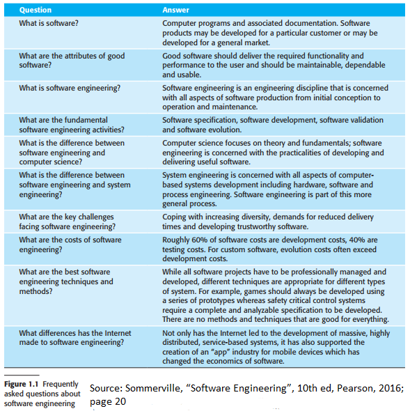
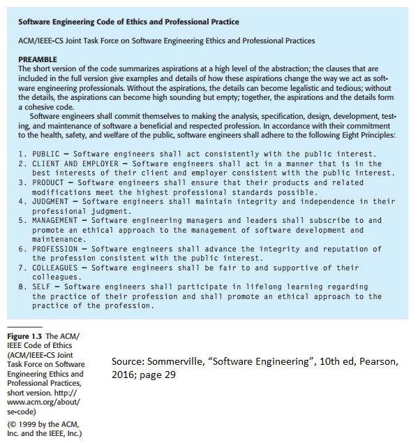
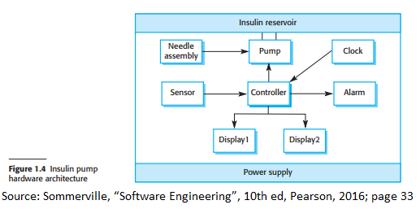
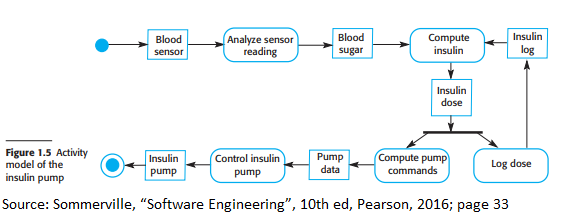
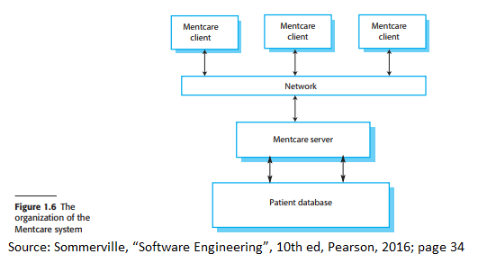
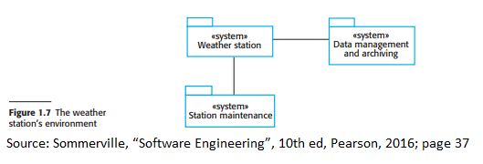
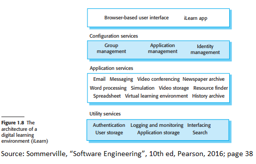

# Chapter 1: Introduction

## Videos

[The textbook author's videos are
here.](https://iansommerville.com/software-engineering-book/videos/se/)

## Preface

You might be wondering, why should I study software engineering? Walk down the
street of New York City or around NYU's campuses and you will probably see few
people who are not on their phones or their laptops. Every one of these
technology runs on some form of a software system; it should be no
surprise that software engineering is vital to everyday life as the whole world
is run by computer systems.

Thus, the idea of software engineering was born to teach engineers the
theories and methods/tools to create and maintain the software used to run the
world. However, do note that there are different methods of software engineering
and not one method is the end all be all. Like how you use different
screwdrivers for different screws, different software engineering methods and
techniques are more suitable for different systems. By honing and using these
techniques efficiently, you can then create your system in an orderly and
efficient matter while cutting down on the cost to create the system which is
another concern that software engineering tackles. Software costs often cost
more than the physical system or hardware itself. More times than not
the maintenance of the software can cost several times more than the cost to
develop the software; thus software engineering aims to also help reduce the
cost to develop and maintain software.

Two potential ways that software projects fail to include:

- **Increasing system complexity**
  - New software engineering techniques have to be made to meet new future larger and more complex systems.
- **Failure to use software engineering methods**
  - Not using software engineering practices can lead to more expensive and less reliable software.

(textbook pg. 18)

## 1.1 Professional software development

### What is software engineering

Software engineering is a discipline that runs from the very start of
the creation of the software to beyond its competition and into the maintenance
of the software. There are two important concepts to keep in mind about what is
the core of software engineering:

- **Engineering discipline**
- **All aspects of software production**

(textbook pg. 21-22)

As stated in the preface, software engineering is important because:

- More people are relying on software systems
- It is cheaper to use such techniques for professional systems as they generally
  have quality assurance, lower cost, and are more maintainable.

Sofware produced can be split into two categories:

- **Generic products**
  - These are stand-alone general-purpose products sold to any customers/consumers
  - **Example**: PC software such as graphics/art programs, project management tools
  - **Example**: Software for specific markets/groups for general use such as appointment systems for dentists
- **Customized or bespoke products**
  - These are tools commissioned by a specific customer to meet their own unique
    needs.
  - **Example**: Systems wrote to a particular business process or air traffic
    control systems.

(textbook pg. 20-21)

The main difference between these categorizations is who specifies what are the
requirements for the software.
In the case of a generic product, the software developers
control the specification and can choose how and what is needed to be made for
their product as there product is for general use and not for a specialized case.
In the case of customized products, the client/consumer are
the ones that outline the specification and requirements that the developers
need to follow.

For the software to be deemed as good, it must follow four principles:

- **Acceptability**
  - The software must be usable for its consumer (whether it means it can run on the customer's systems or if meets the needs of the customer).
- **Dependability and security**
  - The software must not be harmful to the consumer and do not allow any malicious users or criminals to be able to tamper with the software.
- **Efficiency**
  - The software should not waste resources but instead be able to utilize them well and be responsive.
- **Maintainability**
  - The software should be able to address any future changes the consumer may need.

To create such software that follows these four principles, the
software process (a sequence of activities that is used to produce a program)
must include four fundamental activities:

- **Software specification**:
  - Customers and developers define what software is to be built, what
    functionalities it will have, and what constraints it will have
- **Software development**
  - The stage in which the software is made.
- **Software validation**
  - The software is checked to see if it meets its specification
- **Software evolution**
  - The stage where software is maintained to meet future changes in its requirements and specification

(textbook pg. 23)

During the software process, four issues may affect what type of software you produce:

- **Heterogeneity**
  - Can the software run as a Windows app, a Web app, and a phone app?
- **Business and social change**
  - Economies grow and fall which determines the rate at which technology is developed.
- **Security and trust**
  - Consumers should be able to trust their software as software may be related to our lives (ex. pacemakers)
- **Scale**
  - Software should be scalable depending on its usage (ex. from small devices such as smartwatches to large systems like cloud-based systems)

(textbook pg. 24)

### Computer science vs software engineering

Computer science studies the _formal_ properties of _computations_.
See [this excellent lecture](https://youtu.be/fpZ_rviHEAo) on what computation
is.

### Software engineering diversity

There are many types of systems that can be made which include:

- **Stand-alone applications**
  - These applications run on your local computer and do not need access to the Internet.
- **Interactive transaction-based applications**
  - These applications can be used on remote or local computers. These include web applications.
- **Embedded control systems**
  - These are systems that can manage and control hardware.
- **Batch processing systems**
  - These are systems that are designed for businesses with the intent of processing large amounts of data.
- **Entertainment systems**
  - These are systems for personal entertainment.
- **Systems for modeling and simulation**
  - These are systems used to model situations, such as modeling common Physics "problems" or scenarios.
- **Data collection and analysis systems**
  - These are systems that collect data through the use of sensors to be sent to an analysis system to process that data.
- **System of systems**
  - These are systems that are composed of other systems.

(textbook pg. 25)

Despite the diversity of software system types, there are several fundamental
principles that are applicable for all software:

- Systems should be made by using an understood and managed development process.
- Dependability and performance are crucial for the success of all software.
- Developers must understand what the software is for!
- Developers should re-use existing software in preference to writing new programs.

### Internet software engineering

The fact that most software today runs on the Internet introduces new
considerations:

- Does the software work across a variety of user interfaces: popular web
  browsers, custom phone apps, and API access from other programs?
- Is the software secure, given the entire world can access it?

The increasing development of the Internet also allows information storage
apart from local disk drives.
Instead, applications such as Microsoft Office 365 and the Google Suite allow users to house
information in remote "clouds".

## 1.2 Software engineering ethics

### Example professional responsibilities

Similar to how other engineering or science disciplines have an ethics code,
software engineering has the same. Such responsibilities include:

- **Confidentiality**
  - Engineers should keep the information of their clients secret.
- **Competence**
  - Engineers should only work on assignments they have the skills for.
- **Intellectual property rights**
  - Engineers should listen to laws regarding intellectual property and protect such property.
- **Computer misuse**
  - Engineers should not use their skills to the detriment of their consumers.

(textbook pg. 28-29)

### The ethic code and its eight principles

CM and the IEEE are professional associations that created a code of ethics that contains
eight Principles related to how software engineers should behave and make decisions.
These eight principles include:

- **Public**
  - Software engineers shall work for the public interest.
- **Client and Employer**
  - Software engineers shall act in the best interest of clients, employers, and the public.
- **Product**
  - Software engineers shall make products to their best of their abilities.
- **Judgement**
  - Software engineers shall be professional and maintain their integrity when making decisions.
- **Management**
  - Software engineer leaders shall be ethical when managing the development and maintenance of software and employees.
- **Profession**
  - Software engineers shall be professional and work for the public's benefit.
- **Colleagues**
  - Software engineers shall support their peers.
- **Self**
  - Software engineers shall be ethical when practicing their profession.

(textbook pg. 30)

## 1.3 Case studies

### An embedded system: Insulin Pump Control System

### An information system: Mentcare system

### A sensor-based information collection system : Wilderness Weather Station

### A support environment: Digital learning environment for schools

