# Chapter 2 Software processes

## Videos

[The textbook author's videos are
here.](https://iansommerville.com/software-engineering-book/videos/se/)

## Preface 

The software process is a set of activities used to create a software system. 
As stated in the previous chapter, all software processes, no matter how different they are, 
involve these four parts (textbook pg. 44): 
* **Specification**
* **Design and implementation**
* **Validation**
* **Evolution**

In this chapter, we will explain three software processes that can be visualized as a model. 
Note that in practice, the development will most likely not solely follow one model; 
instead, it will use a mixture of some elements from each model.

## 2.1 Software process models

The three generic software processes are:
* **The waterfall model**
  * Model in which the fundamental activities are in separate phases
* **Incremental development**
  * Model in which fundamental activities are done at the same time; the system is developed in multiple iterations with each new version building upon the prior
* **Integration and configuration**
  * Model in which old/already-existing components are used and added to the current version

### Waterfall model

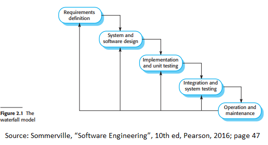

As seen in the image above, the waterfall model has 5 main stages (textbook pg.47):
* **Requirements definition**
  * The system's components, goals, functionalities, services, and constraints will be determined and written in detail in the documentation. This documentation will be known as the system specification. 
* **System and software design**
  * Determine the overall system architecture
* **Implementation and unit testing**
  * This stage involves breaking down the software design into components and verifying whether the components address requirement specifications 
* **Integration and system testing**
  * Every component is combined to form a single system and is tested to see if they components mesh well with each other. 
* **Operation and maintenance**
  * The system is shipped out and maintenance (improving the system and fixing any bugs that were not discovered earlier.

The waterfall model is a straight forward model where the 
software process follows a linear pattern; 
for it to advance to the next stage, the prior stage must be completed. 
Only after the "operation and maintenance" step is completed can 
the project go to earlier steps as it sees fit. 
The waterfall model is commonly known as a **plan-driven** model 
as the requirement specification phase 
and the development phase is distinct from each other; 
the requirement specification phase must be completed before the 
development of the product begins.
As a result, one drawback of this model is that it should only be used if the problem 
is fully understood to limit potential changes to customer needs and wants. 

However, these strict step-by-step processes and lack of foresight into 
potential future changes do not mean that this model is useless. 
Because each stage must be fully completed and understood, this model is very beneficial 
for large projects that multiple teams from multiple sperate locations work on a workflow 
would be more efficient if each team was on the same page/understanding as each other. 

### Incremental development 

Incremental development is a software process model that is as what its name implies; 
the process is conducted in multiple increments. In a way, this model is more natural as 
it is similar to how people solve problems. 
If the problem is not something that is solved in one instance, we work toward the answer through 
multiple steps of iterations of attempts. 
The first step of this process involves outlining the initial product specification. 
A first draft of the product is then made and at the same time, product feedback is taken. 
This feedback will allow for another round of  product specification in which the previous 
product specification is built on top of and an intermediate product version is made. 
This process repeats until a final version is made that meets all the requirements. 

Incremental development can be either plan-driven or agile-developed. 
The difference between the two is that the increments are pre-determined in the plan-driven version 
whereas in the agile-development, later increment versions are determined by what new or 
changed product specifications are made. 

Incremental development has three main benefits:
* Cost of development due to change is lowered as change is accounted for in this process. In other words, you are expecting change to happen; any new changes will not undermine previous versions to the point where the product and other such documentation must be redone.
* Important features are usually prioritized first to have usable software. This in turn makes a working version (although not necessarily one that is complete and meets all the requirements) of the product can be deployed earlier 
* With faster delivery, customers can comment on the product earlier.

Incremental development has two main drawbacks:
* The process is not visible as multiple versions of the product may be happening at the same time and there may not be one "main" version. It will also cost a lot to create a lot of versions of the product. [**Note from Professor Callahan**: This "drawback" is nonsense: a principle of Agile is *make work visible*. It is the Waterfall Model that hides the work.]
* Adding multiple changes may degrade the original system structure as code must be refactored to better optimize it. Think of this as the Telephone Game. In this game there are multiple people lined up; on one end, one person tells the person adjacent to him a message.  This person must repeat the message to the other person who is adjacent to him until the message goes down the line to the last person on the opposite end but each person cannot ask the prior person to repeat the message. Each person could alter the message until when the final person receives the message, that message may be completely different and may not make sense in the end. Similarly, every added change to the software would require the development team to make sure the original features still work and the new features were integrated properly into the prior version to create the new version.

### Intergration and configuration

Integration and configuration is the process of using already existing code. 
Instead of building from the ground up, the already existing code would be modified and added to whatever 
prototype development has been produced so far.  

Examples of when this model is used for is for (textbook pg. 52): 

* Stand-alone applications
* Collections of objects that are bundled into a package that will be used for a framework 
* Web services that have to follow a standard 

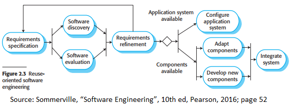

**Reuse-Oriented software engineering** is based around this software process model and has 5 main steps:
* Requirements specification 
* Software discovery and evaluation 
* Refinement of requirements 
* Configuration and adaption of software
  * If the software is an application system, configure it
  * If the software is a component(s), adapt the components and develop new ones if necessary to prepare for integration.
* Integrate the discovered system into the current prototype/iteration

Benefits | Cons
------------ | -------------
Because less new software is made, development costs are lowered| Reusing code instead of creating from scratch may mean that those reused codes may not work with future additions of features. 
Faster deployment of software | May have to worry about licensing of borrowed code which may increase the cost

## 2.2 Process activities

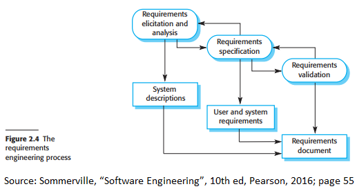

In this section, we will discuss what the four process activities (specification, development, validation, and evolution) entail. 

### Software Specification

Software specification, also known as the requirement engineering process, 
is the stage where developers will figure out and outline what 
features are required by stakeholders. The result of this process is 
to create documentation that stakeholders understand and add upon to aid developers 
know what features they (the developers) need to create to meet the needs of the client. 
Software specification can be visualized as the top 3 bubbles in figure 2.4. 

Note that stakeholder requirements and whereas system requirements 
are not interchangeable with each other; this difference will be explained in a later section. 

The requirements engineering process is composed of three main stages (textbook pg 55):
* **Requirements elicitation and analysis**
  * This stage involves discussing the setting in which the system will be used (who are the users, what environment/hardware will they be using, etc.), and what functions and other such requirements will it need.
* **Requirements specification**
  * This stage is writing the information discussed in the prior step into two actual documents: user requirements and system requirements. User requirements are what functions and systems users want. System requirements are descriptions of the functions that are more detailed, generally containing terminology more relevant for developers so they can have a better understand of what is needed. 
* **Requirements validation**
  * This stage involves checking over the documentation and fixing any errors. Errors can also include whether requirements are realistic and complete. 

### Software design and implementation

Software design and implementation can be visualized as the layer that is comprised of the bottom 3 rectangles in figure 2.4. 

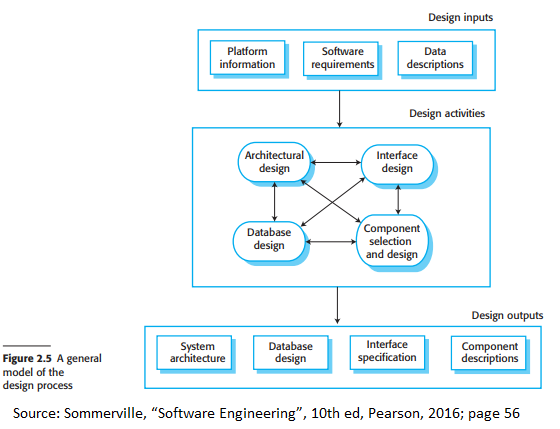

Figure 2.5 outlines the process in which a software design is made. 
Design inputs are the foundation of the software as they are the required parts 
that the software must either include or adhere to. 
Platform information is the information regarding what other software systems 
the product will interact with. Examples of these other systems include an operating system, 
database, and other applications. Requirement specifications are the specification 
of what the system will require and what functionalities the clients want in the product. 
Data descriptions are what datasets the product might rely on.

After taken into consideration the inputs, developers will then consider four designs to make (textbook pg 57): 
* **Architectural design**: involves the system structure and the relationship between any components or subsystems of the structure.
* **Database design**: involves how data is represented in the database. 
* **Interface design**: involves UI (user interface) for components and how information may be sent from one component to another component. 
* **Component selection and design**: involves reusable and new components and descriptions of such. These are usually drawn in UML diagrams. 

### Software validation

Software validation, also known as V & V (Verification and validation), 
is used to test whether or not the current the version of the software meets 
the demands of the consumers and any such specification. This process may involve 
using dummy/fake data or specific test cases to simulate the usage of the software.

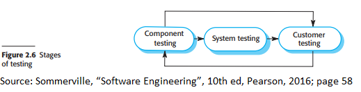

In a simple software testing process, there are 3 main stages (textbook pg 59):
* **Component testing**
  * In this phase, individual functions are components are tested as single parts; in other words, each component is tested isolated from each other. 
* **System testing**
  * The entire system will be tested to make sure each component works with each other.
* **Customer testing**
  * The consumer tests the system to give their opinions to see if the system meets the consumer's needs.

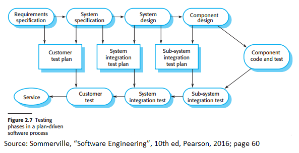

Figure 2.7 shows a more complicated form of testing that is mostly used in plan-driven software processes such as in the waterfall model. 

### Software evolution

Software evolution is also known as software maintenance as the software has to be flexible; 
changes to requirements are consistent and software must be able to evolve 
or be maintainable to address those changes. Figure 2.8 outlines the thought process
 that occurs during software evolution.  

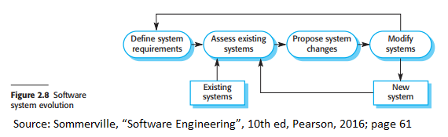

## 2.3 Coping with change

It should be apparent that change is inevitable. 
We see in the last two decades physical technology has evolved and advanced 
greatly and software is the same as well; with growing times, the needs and 
wants of people change. Software projects will eventually need to be reworked 
to account for different business changes, new technologies and techniques being 
used, and the obsolescence of platforms. 

Change, therefore, is expensive as it means the current working version must 
be redone to meet the new changes. Two ways to reduce the cost of reworking include:
* **Change anticipation**
  * Software process anticipates potential changes that should be addressed through the use of prototypes.
* **Change tolerance**
  * Software processes make it so changes can be easily incorporated into the system through usually the use of incremental development. 

### Prototyping 

System prototyping is used to aid in limiting the number of changes 
needed after the final product is made. A **prototype** is an early iteration 
of the desired product that is a proof of concept; it used to test out designs 
and to see if there are problems that need further consideration and analysis. 

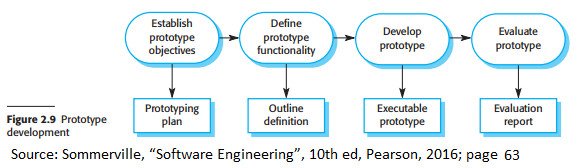

Figure 2.9 outlines the steps to creating a prototype. The top row is the actual processes 
that is done whereas the bottom row represents what documentation will be produced via those actions. 
The steps are as follows (textbook pg. 63):
* Establishing prototype objectives 
  * This means that developers will agree on what is the end goal of the product. Is it to create a usable user interface? Is it to add CRUD (Create Read Update Delete) operations to the application?
* Define prototype functionality
  * In this stage, developers will decide what functionalities the prototype must-have. The prototype does not have to have all the functionalities required for the final product. For example, if the objective of the prototype is to create a user interface for the user interface for the login and account creation pages for the software, the actual account-creation functionalities do not need to be added for this prototype.
* Develop prototype
  * This stage is the actual development and creation of the prototype.
* Evaluate prototype
  * In this stage, the prototype will be evaluated by whether or not it achieved its objective.

Benefits of prototyping include:
* More resembles what the client needs 
* Reduced development and maintenance cost 
* Improved maintainability and usability 

### Incremental delivery

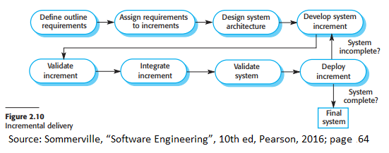

Incremental delivery is the process of breaking down the system into multiple segments 
with each segment being built upon the before add more required functionality. 
Every iteration/prototype of the software is given to the client so they 
can comment on the progress and ask for any changes they would like during 
the development process. Because of this, generally the most important requirements 
(usually the user/client requirements) are done in the first increments to be able 
to provide the client a usable early prototype. 

Advantages of incremental delivery include:
* Customer can give opinions earlier as system functionalities are prioritized first to give working versions to customers faster 
* Higher priority functionalities receive more testing 
* Projects  have a lower risk to fail 

Problems of incremental delivery include:
* People may be unwilling to stop using a working but slow component of a system instead of a new similar component that works faster but is incomplete. 
* Common basic functions that are required by different components of the system can be difficult to identify as requirements are not fully developed in every iteration. Requirements are added and removed in every iteration.
* This is an iterative process that goes against the procedural nature of many organizations. In other words, organizations would like to have everything planned out beforehand whereas incremental delivery requires multiple iterations of the product to be made until the specification is finalized. 

## 2.4 Process improvement

To be competitive against similar products, software companies must 
both maintain their product as well as improve their quality. 
The goal of process improvement is to identify what component 
(whether developmental or organizational as in )

Two approaches to improvement include:
* **The process maturity approach:**
  * The process maturity approach focuses on improving the management of the development process as well as using good software engineering practices to efficiently produce good products with high quality. 
* **The agile approach**
  * The agile approach focuses on having minimum overhead over the software development process. This approach relies on iterative development and rapid delivery. 

## The process improvement model
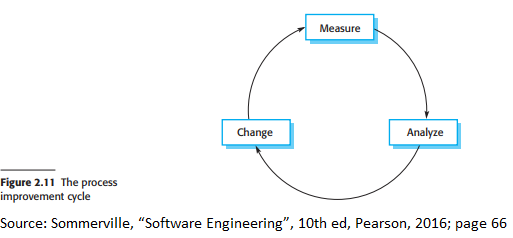

In general, the process improvement model is a cyclical process with three stages:
* **Process measurement**: involves examining activities or components of the software process or product respectively by taking quantitative data on these parts. 
* **Process analysis**: involves analyzing the quantitative data produced in the prior stage and possibly creating models or charts from the data to see where weaknesses may lie in which sectors of the software process. 
* **Process change**: involves addressing and solving the problems found in the first 2 stages. 

### The Software Engineering Institute (SEI) Model of Process Capability Maturity

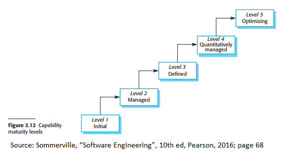

The maturity of a model can be seen as how good software practices are 
used in a company and how well processes are managed. 
The SEI Model visualizes this in five different levels where the 
the bottom-most level is the least "mature" whereas the topmost is the most "mature". 
In other words, the higher up you are in this model, the more likely the company 
is managing software processes well. These levels are as follows:
* **Initial**
  * At the bare minimum, goals, and work are outlined by team members but not recorded. 
* **Managed**
  * Organization policies are defined and project plans are documented.
* **Defined** 
  * Projects have a managed process in the form of project requirements and measurements regarding processes are taken.
* **Quantitively managed**
  * Subprocesses are also taken into consideration and data is taken about them. These data in addition to other process data are examined and used to manage processes.
* **Optimizing** 
  * Organization measures and analyzes trends within processes and products to improve the software development process.

