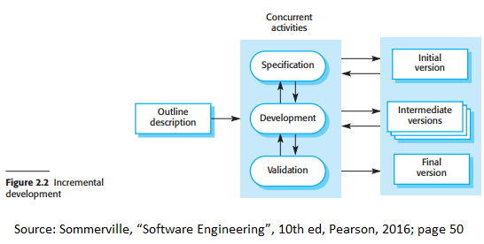

# Chapter 2 Software processes

## Preface 

### Four Fundamental Software Engineering Activities 

### What influences the sequence of activites 

## 2.1 Software process models

### Three general process models 

### Waterfall model

### Incremental development 

### Intergration and configuration

## 2.2 Process activities

### Software Specification

### Software design and implementation

### Software validation

### Software evolution

## 2.3 Coping with change

### Two approaches to reducde costs of rework

### Prototyping 

### Incremental delivery

## 2.4 Process improvement

### Two approaches to process improvement and changes 

### Cyclical Process

### The Software Engineering Institute (SEI) Model of Process Capability Maturity

