# Chapter 3 Agile software development

## Videos

[Agile videos from the textbook
author.](https://iansommerville.com/software-engineering-book/videos/agile/)

## Preface

Rapid development and delivery is an important factor for software engineering
as software needs to be able to address new changes to requirements. To address
this, agile methods were created to put more emphasis on the end product rather
than the documentation that may be made along the way. In other words, of
working long hours on documentation, the agile approach aimed to cut the
overhead caused by the documentation and focus on the development of the actual
code.

### Common characteristics of Agile methods

Every agile method share these characteristics:

- Specification, design, and implementation are mixed as system specification, design documentation, and user requirements are usually minimized to save time during development or are automatically generated.
- Systems are usually developed in increments so that consumers and other stakeholders can give their input during the development phase
- Many tools are used to aid during development. Examples of such tools are tools that automatically test your code, help you make the process of designing and creating the user interface easier, etc.

### Distinction between plan-driven processes and agile development

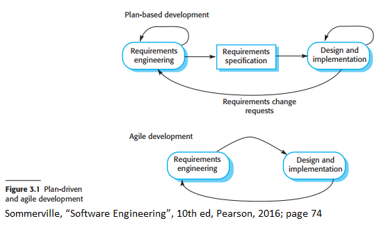

The image above outlines how plan-driven processes and agile development are
different. Plan-driven processes have their iterations within separate stages.
Documentation is then created to move to the next stage. However, in the agile
approach, the activities requirements and implementation are done at the same
time.

Do note that these approaches to development are not so black-and-white; doing
one does not mean you cannot do the other as generally during actual
development, one approach would be mainly used but will draw some elements from
the other approach.

## 3.1 Agile methods

### Agile manifesto

The agile manifesto is a collection of principles that
explain the reasoning behind the agile approach. These principles include:

- **Customer involvement**
  - Stakeholders should give their input in all stages of the development process to show what components should be prioritized and give input that can be analyzed to evaluate the progress of every iteration.
- **Embrace change**
  - Change is inevitable therefore the system should be designed in such a way to relieve the potential stress caused by change.
- **Incremental delivery**
  - Software should be incrementally developed in small batches to test components and allow for feedback.
- **Maintain simplicity**
  - Systems should be simple where applicable.
- **People, not process**
  - People's skills should be recognized and used.

### Product development and custom system development

Agile methods work best in two system development methodologies:

- **Product-development**
  - This is when the software is small or medium-sized intended to be sold.
- **Custom-System development**
  - This occurs within an organization with few stakeholders and dedicated customers that can provide ample feedback.

Agile methods work best in these scenarios because the software created generally is not used to be integrated with other systems and there can be feedback provided about the software.

## 3.2 Agile development techniques

### Extreme programming

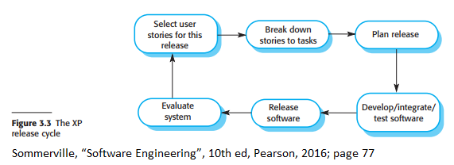

Extreme Programming, also known as XP programming, is as what is sounds;
agile methodologies are taken to an "extreme" level. The goal of this development
technique was to create several increments within a day and be able to test them.

Instead of creating a document regarding requirement specifications, scenarios
known as user stories are used instead. Pair programming is conducted, and tests
are created before the code is written. All tests must be passed successfully for
the tested code to be added to the system.

Extreme programming includes the following practices:

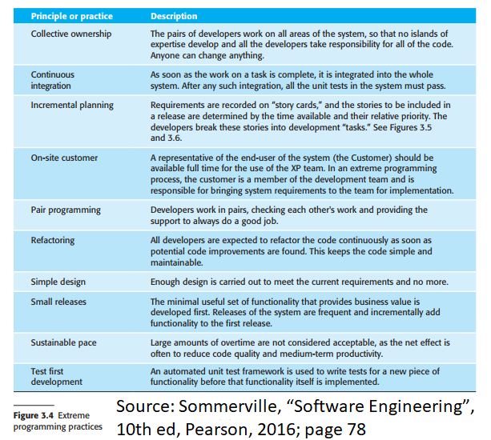

Because of this long list of practices, generally not XP practices can be
implemented for a project. Because of this, only a select few are used during
development depending on their usefulness.

### User stories

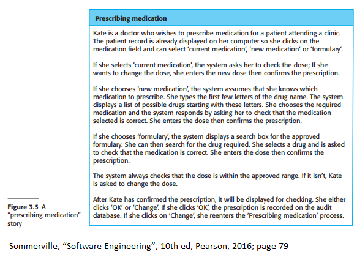

To combine requirements elicitation with development, user stories are used.
User stories are what the name implies: a story on how the user interacts with
the software. "Story cards" are developed from these stories and focus on what
stakeholders need from the software. These stories and needs will then be
broken down to specific functionalities of the software or tasks that need to
be implemented. Stories that provide the most important functionalities will be
prioritized first as they are the ones that are more useful and can help create
and deliver a working version of the software earlier.

Benefits of user stories include:

- Stories are more relatable than documentation
- Stories can suggest what are key requirements the software must have or do. In other words, they are helpful for requirements elicitation.

Problems of user stories include:

- Users may not go over all the requirements they need from one story.
- Stories may not give a good view of the requirements.
- Terminology differs from developer and consumer as consumers are more familiar with the software.
  - This may lead to consumers leaving out details when describing how they use an application as they are used to using it and may deem actions useless or forgettable.

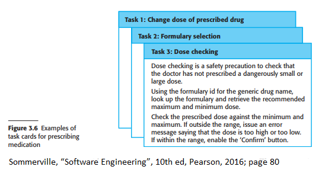

### Refactoring

Extreme programming believes that you should not design systems to cope with
change because often times anticipated changes may not occur or a completely
different change occurs. Instead, code should be refactored, or in other words improved,
constantly. Refactoringincludes renaming names of methods and attributes, removing duplicate code to
reorganize class hierarchies and relationships, replacing code that is similar
to each other, etc. The objective of doing this is to make developers
understand the software more which would lead to less of a need for
documentation due to the code being easier to understand and structured well.

However, refactoring is not always possible as developmental pressures may
occur and push for new features to be implented instead of refacotring old code.
Refactoring system archiectures are also extremely expensive.

### Test-first development

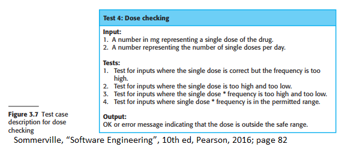

Extreme Programming included new ideas of testing. Four key principles of testing
in extreme programming are:

- Test-first development / test-driven development
- Incremental test development from scenarios
- User involvement in the test development and validation
- Automated testing frameworks

(textbook pg 81)

In test-first development/test-driven development, tests are written first
before any code is written. This will allow developers to run tests alongside
the development of code to prematurely find any errors with their code. This
means that developers must fully understand specifications as they need to
write tests that can adequately test for potential problems. This implies that
user stories/scenarios have been made as each story can provide an
implementation that should be tested.

Users are then also more involved in the testing process as their data (or
possibly dummy data) will be used to test the system. There may also be a
dedicated customer that will be part of the team that can aid in writing or
suggesting tests that should be made.

To help facilitate testing, there are automated testing tools that can be used.
These tools can be used to simulate adding input and crosscheck if the result
matches the desired result. Examples of such software include Junit, Travis CI,
etc.

Problems of test-first development include:

- Incomplete tests may be made as it is impossible to test for all exceptions. In other words, tests can be written incompletely or haphazardly.
- Tests may be difficult to be written incrementally.

### Pair programming

Pair programming is the idea that programmers will dynamically develop software by working together.

Benefits of paired programming include:

- Reflects the idea of collective ownership where responsibility falls on the whole team rather than a single person.
- It is an informal code review as two or more people have read the code which makes finding software errors easier and cheaper than having formal inspections of code.
- It encourages refactoring and discussing the software before its implementation.

## 3.3 Agile project management

Software project managers are people who manage projects to make sure they are
within budget and are delivered on time. In a plan-driven process, managers
usually create a plan to outline what needs to be delivered and who will work
on those components. In contrast to this, there are agile project management
approaches that can be used in tangent with agile methods to help with
incremental development to limit overhead caused by documentation.

### Scrum

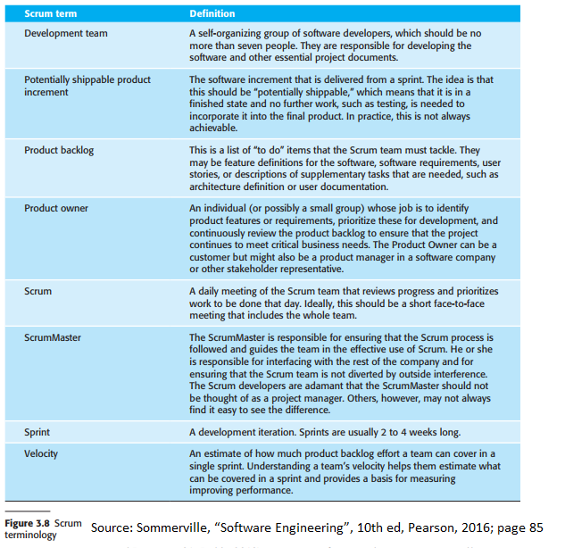

Scrum is an agile approach that focuses on the management and organization
of iterative development. There are three main phases in Scrum:

- **Initial Phase**: begin by outlining objectives for the project and a rough design of the software architecture.
- **Sprint Cycles**: are the incremental portion of development; each cycle will develop an increment of the project.
- **Closure phase**: involves wrapping up the project and completing any documentation that is required

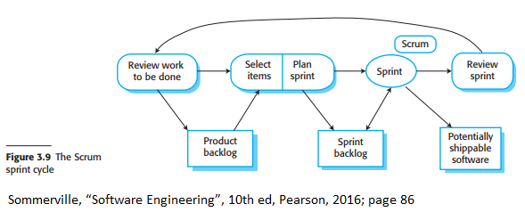

Scrum sprints have a fixed length (usually 2 - 4 weeks) and begin by the
creation of a product backlog which is a list of objectives and work that
should be done. The next stage is the selection phase where features and
functionalities are selected from the product backlog. These will be the
components that will be worked on during the sprint as they are usually the
components deemed to be the most important and can be reasonably done well
during the time frame. After this stage, teams are organized to develop the
software.

Teams will hold short daily meetings known as Scrums to discuss current
progress and any changes they need to make towards prioritization of features.
This allows everyone on the team to know what is currently happening and can
replan activities quickly if needed. to maximize the time of creating the
code, the development team is also isolated from stakeholders and other members
of the organization. Instead, one member known as the Scrum Master will help
facilitate the organization of the sprint. They are tasked to arrange the daily
Scrums, track what is being done and what is to be done, communicate with
stakeholders and management, and other such organizational activities.

At the end of the sprint, the work will be reviewed and shown to stakeholders
for any feedback to be used in the next sprint cycle.

Benefits of Scrum include:

- Development is broken into multiple iterations that are manageable and understandable by all members.
- The whole process is visible as the whole team knows the current progress of development.
- Change or unstable requirements will not hold up progress as teammates can quickly adapt to the change.
- Customers will get fast delivery of increments which will allow them to give feedback earlier.

### Distributed Scrum

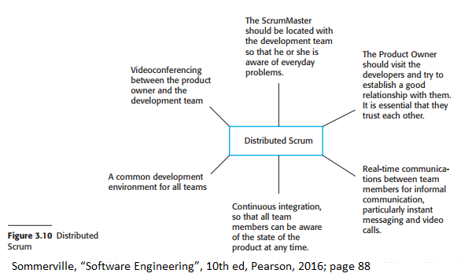

Due to the growing possibilities of the internet, teams that are working on a
project are not necessarily in the same office or building. Figure 3.10
outlines requirements for distributed Scrum, a methodology that can be used by
multi-teams environments or teams that are in different locations.

## 3.4 Scaling agile methods

Generally, Agile methods are used by smaller teams as communication between
members is easier as everyone is working together. However, agile methods can
be applied to address concerns of larger and longer projects or multi-team
projects.

### Scaling agile methods features

There are two important terminologies regarding upping agile methods:

- **Scaling Up**
  - This means that certain agile methods will be used for developing larger software systems that are too cumbersome for smaller teams to work on.
- **Scaling Out**
  - This means that organizations are too large and certain agile methods are needed to track and manage these large-scale teams.

In both scenarios, it is still important to maintain the principles of Agile
development where there are frequent releases of the system, continuous
integration, test-first/test-driven development, good communication within
teams, and flexible planning.

### Practical problems with agile methods

The main problems with scaling up/out agile methods include:

- Agile development is incompatible with contracts that large companies usually use.
- Agile methods do not work with maintaining systems and are more used for the development of the system.
- Agile methods work best for small teams that are in the same area.

Software contracts are written when a customer outsources for an external
organization to help develop the desired system. Due to the nature of Agile
development, there are no requirements that are clearly defined in the
contract. This presents a problem because contracts usually pay for time spent
on development rather than if the functionality is adequately made. If the
functionality cannot be delivered on time, who is to blame? Should the customer
pay for more time for development or should the developers be blamed for
quiring more time and resources?

As said before, software maintenance usually costs more than software
development. Due to the nature of Agile methods, there are three main problems
with developing software with such methodologies:

- Can systems made by using Agile methods be maintained if there is minimal documentation?
- Can agile methods create a system that can adapt to change in customer requirements? Can customers be actively involved in the development process?
- What happens if the original team cannot also be maintained?

### When to use agile and/or plan-driven methods

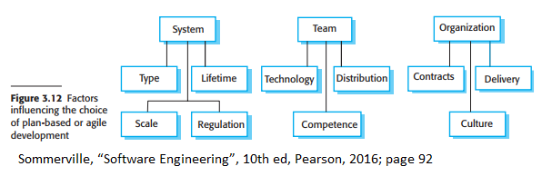

Figure 3.12 showcases some factors that should be considered to determine
whether an agile and/or plan-driven model should be considered. Some example of
issues/questions and answers to this include:

- Is it important to have detailed documentation before implementation happens?
  - Use plan-driven approach
- Is it realistically feasible to have stakeholders give constant input and developers can deliver many prototypes?
  - Use Agile approach
- How large is the system?
  - Agile methods work best in small co-located teams; use a plan-driven approach is the system is too large and requires bigger or multiple teams.
- What type of system is being developed?
  - Systems that need analysis before implementation should use a plan-driven approach.
- What is the expected lifetime for the system?
  - Long-lifetime systems will need documentation that plan-driven approaches favor.
- Is the system subjected to external regulation?
  - Documentation will be required thus a plan-driven approach should be used.

### Agile methods for large systems

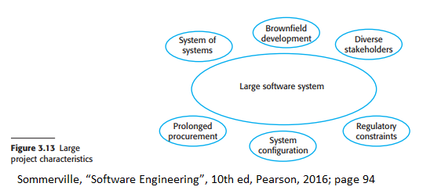

Six factors that explain why large-scale systems are more complex to manage and understand are:

- **System of systems**
  - Large systems are usually composed of systems that communicate with each other where separate teams work on each system.
- **Brownfield development**
  - Large systems are "brownfield systems", meaning that they interact with other existing systems that have strict system requirements that do not allow for the flexibility of incremental development.
- **Diverse stakeholders**
  - Stakeholders want to see projects go toward their requirements; every person has their vision of the project that may clash.
- **Regulatory constraints**
  - External rules and regulations can limit how development processes are conducted and what they can do.
- **System configuration**
  - A large amount of time must be spent configuring the system to allow for the integration of components into the system.
- **Prolong procurement**
  - Large systems require a large development time and commitment; there may be problems of people leaving the project team which will require retraining new members.

### IBM's Agility at Scale Model

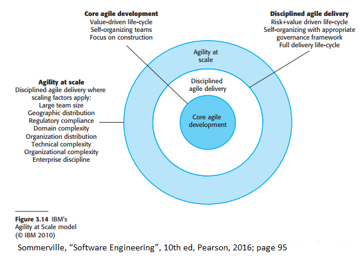

IBM has developed a model known as the Agility Scaling Model (ASM) to show
visualize the scaling of Agile methods in three stages.

The inner scale is known as the core agile development which is the basic Agile
approach. The second layer is the Disciplined Agile Delivery which involves
using agile practices in an organization. Teams will be organized such that
they cannot only focus on development but must also focus on other processes
such as architectural design and requirements elicitation.

The last layer is called Agility at Scale, which involves acknowledging factors
that complicate the usage of Agile methods in large scales, such as distributed
development, regulations, and legacy environments.

Approaches to scaling agile methods for larger systems have 5 commonalities:

- You cannot solely use an incremental approach for requirements engineering.
- There cannot be only one customer representative to help with development.
- Large system development cannot only focus on code.
- There should be tools to help facilitate cross-team communication.
- It is virtually impossible to continuously integrate components. Frequent builds and releases of systems should still occur though.

### Multi-team Scrum

Scrum can be used for multi-team environments. Features of multi-team Scrum include:

- **Role replication**
  - Each team has a Product Owner and ScrumMaster
- **Product architects**
  - Each team has a member who is a product architect that will work with other architects to design and evolve the system architecture.
- **Release alignment**
  - Product releases for each team will match with each other so a complete system can be created
- **Scrum of Scrums**
  - There are additional daily Scrums where each team has a representative that will meet to discuss progress.

### Agile Methods acorss Organizations

Difficulties with integrating agile methods into large organizations include:

- Project managers may not have a lot of experience with agile methods and will not take the risk of using an approach they do not understand or know the effects of.
- Large organizations have procedures to follow and maybe incompatible with Agile methods.
- Agile methods work best when members of the team are highly skilled but large organizations have members with varying degrees of skills and capabilities.
- Conventional or older processes may be preferred over agile methods as they have been used longer.
