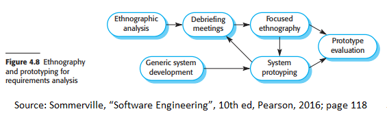

# Chapter 4 Requirements engineering

## Videos

[Requirments engineering videos from the textbook
author.](https://iansommerville.com/software-engineering-book/videos/req/)

## Preface

### User Requirements vs System Requirements

### What are stakeholders

## 4.1 Functional and non-functional requirements

### Functional requirements 

### Non-functional requirements

## 4.2 Requirements engineering processes

### Spiral Model

## 4.3 Requirements elicitation

### Difficulties of eliciting requirements 

### Process Model of elicitation and analysis process

### Requirement elicitation techniques

### Stories and scenarios

## 4.4 Requirements specification

### Notations for writing system requirements 

### Natural language specification

### Structured specifications

### Use cases 

### Software Requirements Document 

## 4.5 Requirements validation

### Types of requirement checks

### Application of checks in requirement reviews, prototyping, and test-case generation 

## 4.6 Requirements change

### How changes in business environment affects system requirements

### Requirements management planning

### Requirements change management

