# Chapter 4 Requirements engineering

## Videos

[Requirments engineering videos from the textbook
author.](https://iansommerville.com/software-engineering-book/videos/req/)

## Preface

As stated in previous chapters, requirements engineering is the process of 
outlining what are the requirements that stakeholders want and other such constraints 
that the system must follow. Requirements can follow two extremes, from abstract statements 
of what is needed overall to more detailed explanations and possible implementations of features. 
Figuring out what the requirements are for a project is important because it serves as a 
starting point for development. How would you know what features are necessary if you do not 
know what they are in the first place Requirements can be used as a measure for the success of 
the product; did the product meet all of the requirements of stakeholders? Which requirements 
could not be implemented and why could we not implement this?

This chapter will focus on requirements engineering and go more in-depth about 
types of requirements and how to come up with requirements, 
validate them, and account for the change. 

### User Requirements vs System Requirements

User requirements are statements and diagrams written in "natural language" 
(in other words, using more generalized or colloquial terms) and are more geared 
towards customers and other such stakeholders. They tell the consumer overall what 
the product can do and what constraints the product must operate in. 

System requirements, on the other hand, are more geared towards software developers 
and clients. They go more in-depth about what features should be implemented 
and what are the constraints for the system by explaining the exact steps that each feature will work. 

Figure 4.1 shows an example of the difference between user and system requirements. 

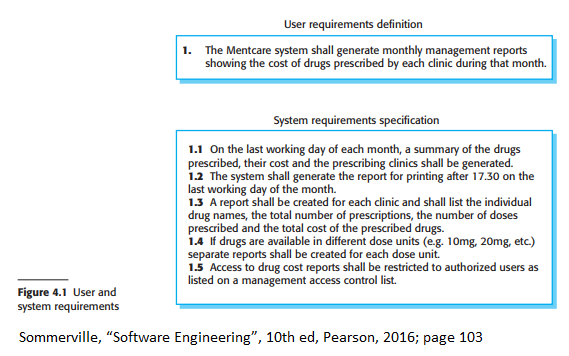

Figure 4.2 outlines potential readers of requirement documents. 

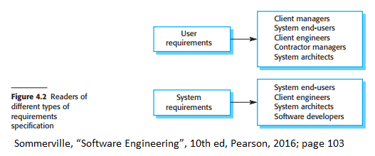

### What are stakeholders

Figure 4.2 are examples of what are system stakeholders; a stakeholder is 
any organization or person that is interested in the product, whether they 
want to buy the product or are affected by it in any way. 

## 4.1 Functional and non-functional requirements

### Functional requirements 

Functional requirements focus on what individual functionalities the system should do. 
For example, they address what the system should do, how the system will parse 
through inputs, and more generally, how should the system behave in situations. 
This may also include what the system should not do when it faces certain situations. 
Some considerations to take into account when writing functional requirements include 
what type of software is being used, the background of the user 
(in other words, who is using the product), and where the software is being used. 

For example, some functional requirements of the Mentcare system 
(a system where users can receive medical treatment) include (textbook pg 106):
* Users shall be able to search for available appointment times for clinics 
* The system shall output a list of who has appointments for the current day to the clinics 
* Each employee using the system can be identified by a unique employee number 

Functional requirements should be precise to have few, if none, imprecisions as 
developers and stakeholders may understand terminology differently. 

Requirements should be 
* **Complete**
  * include descriptions of every required service 
* **Consistent**
  * there are no contradictions or differences in descriptions for the system services. 

In other words, ambiguous requirements will be interpreted differently by 
stakeholders and developers. Let us take the first functional requirement in 
the example above; what does the word "search" mean? Users may interpret this 
functional requirement as being able to search for all open appointments for every clinic; 
developers may interpret this as the users should first pick a clinic then 
see every available appointment for that specific clinic. 

### Non-functional requirements

Non-functional requirements focus on the constraints on the functionality of the 
system as a whole rather than individual components. This may include what times 
the application can be used, constraints imposed by work standards, operating system 
requirements, response times, I/O device capabilities, etc. This can also requirements 
for the development process, such as what programming language is to be used for the 
project as well as what IDE is mandatory. You can see non-functional requirements as 
being more vital than functional requirements as if the non-functional requirements are not met, 
the system will not function and may be useless as the functionalities of the system cannot be used. 

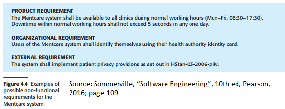

Implementing non-functional requirements is difficult for three reasons:
* Non-functional requirements can affect system architectures 
* Non-functional requirements might cause the need for new functional requirements. They can also create requirements that restrict pre-existing requirements. 
  * For example, security requirements may require 2FA  to login which will require a functional requirement of needing verification of the account.
* Non-functional requirements should be measurable. 
  * For example, stakeholders can impose goals such as being easy to use or fast user response. Developers will need to be able to judge these qualities with numbers to make sure they reach those requirements.

Figure 4.5 shows show ways of measuring specific properties:

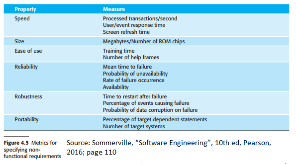

Figure 4.3 categorizes non-functional requirements into 3 types:
* **Product requirements**
  * These include how the product should behave in terms of speed, reliability, etc. 
* **Organizational requirements**
  * These include policies or steps outlined by the higher organization, such as standards in process, implementation requirements, etc. 
* **External requirements**
  * These include factors outside of the control of the system and developers, such as laws, regulation approval, interoperability, etc.

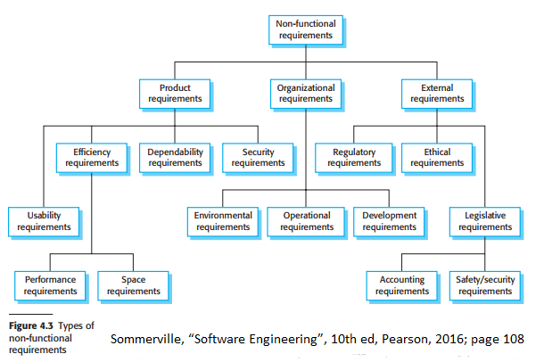

## 4.2 Requirements engineering processes

The requirement engineering process varies depending on what applications 
are being made, what organization is leading the development, and other such 
people involved. However, the requirement engineering process can be broken down into 4 steps:
* Requirements elicitation
* Requirements analysis 
* Requirements validation
* Requirements management

However, in practice, these steps are done iteratively where each step is done in conjunction with the other. 

### Spiral Model

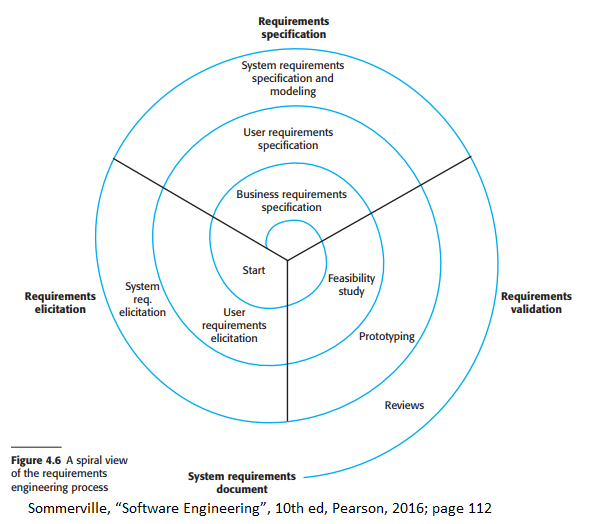
The spiral model shows how the requirement engineering process steps are interleaved and iterative. 
The spiral model outlines the beginning of the process and shows a rough 
estimation of which documentation will be made during a specific stage. 
The number of cycles in Figure 4.6 does not mean there are only 3 cycles as the 
number of cycles (or time for development) is dependent on the available budget, 
the type of system being developed, and other such factors. After this process 
is completed, a system requirement document is formed. 

## 4.3 Requirements elicitation

Requirement elicitation is the stage where requirements are discovered. 
This process focuses on understanding what stakeholders do and how they may 
use the software in their work. This will involve technical staff to understand 
what services should be provided, how the system should be operated and what constraints should it have, etc.

### Difficulties of eliciting requirements 

Eliciting requirements is difficult for several reasons:
* Stakeholders may not know what they exactly want from the system because they do not know precise terminology, making it difficult to express what they want in just general terms. 
* Stakeholders may ask for unrealistic features
* Stakeholders may express their wants in their terms with knowledge from their field that requirement engineers may not understand or have experience in.
* Different stakeholders have different requirements and needs that requirement engineers have to filter through and find potential conflicts. 
* Organizational Political factors can affect requirements
  * For example, managers may use a specific system from a company to build a relationship with that company. 
* Economic and business environment change which may create new requirements and/or make old requirements trivial as new stakeholders enter or leave.

### Process Model of elicitation and analysis process

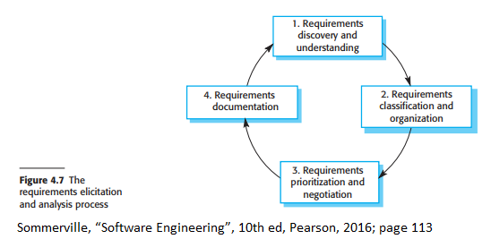

Requirement elicitation and analysis are visualized in figure 4.7 below. 
Each organization will have its  model that they follow but generally, the process can be broken down into four steps:
* **Requirements discovery**
  * Interacting with stakeholders to find what their requirements are
* **Requirements classification and organization**
  * Related requirements are organized into clusters/groups
* **Prioritization and negotiation**
  * Requirements are prioritized and solved if there are conflicts among requirements
* **Requirements specification**
  * Requirements are finalized for that stage and documented for the next round of development

### Requirement elicitation techniques

Many techniques are used during the requirement discovery stage as it is 
important to gather useful information from stakeholders of different ranks. 

### Interviewing 

Interviews (informal or formal) can be conducted with stakeholders and 
can be closed (based on a list of questions drawn up before the interview) 
or open (issues are explored with stakeholders who can also pose their questions)

Effective interviewing involves being open-minded to take every view/angle 
stakeholders look at and prompting involvement with the interviewee, such 
as by suggesting requirements and their opinions about it. 

In practice, interviews are good for getting a general understanding 
of how stakeholders will interact with the system.

There are two difficulties when using interviews:
* Application specialists use specific terminology related to their work; it may be difficult to not use those terminologies that requirement engineers may not understand. 
* Stakeholders may use implicit knowledge that they think is too trivial to mention since they are used to taking that action.
  * For example, postal workers may not mention that packages are sorted before delivery as it may be one of the first steps taken. This step may not be obvious to the interviewer and will be left out as a requirement.  

### Ethnography 

Ethnography involves hiring a social scientist to analyze how people work. 

Ethnography works best at discovering two types of requirements:
* Requirements based on how people work instead of how models of workflow outline how people should work. 
* Requirements based on cooperation and knowing what others are doing

In other words, ethnography is good for understanding existing organizational 
requirements rather than identifying new requirements. 

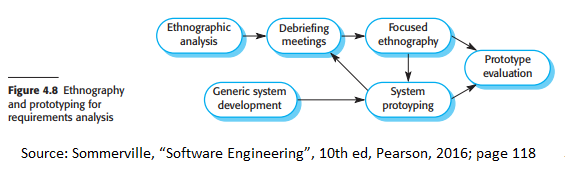

Ethnography can be combined with the idea of system prototyping by reducing 
the number of prototype cycles needed. Questions or problems of the latest 
prototype can be used by the ethnographer to help analyze and deduce what 
actions must be made to improve the prototype. Figure 4.8 outlines this process.

### Stories and scenarios

Stories and scenarios are descriptions of how a system is used. They show 
how users interact with the system (for example, what buttons do they press 
to access a feature). what are the inputs and outputs of the system, and 
what types of systems have they interacted with. Because they are practical 
and real-life accounts of how people use the product, stakeholders tend to be 
able to relate to them and can add their own opinions more easily. 

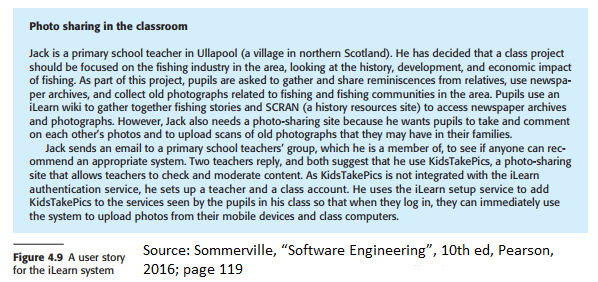

Stories generally are written as a narrative and have a higher-level description 
of how the system is used. In contrast, scenarios are a more structured form 
of user stories that can be broken into 5 main parts:
* Description of the start 
* Description of the steps taken in the event 
* Description of errors that can occur 
* Information about anything that is happening at the same time
* Description of the end state when the event ends 

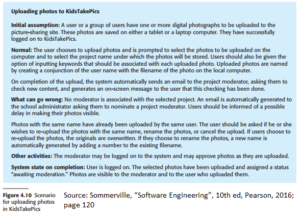

In other words, you can think of scenarios as a more "filtered" version of a 
story where it removes any unnecessary information contained in a story and groups them into the 5 general steps. 

## 4.4 Requirements specification

The requirement specification is the actual process of documenting the user 
and system requirements. As stated before, user requirements are moire "natural" 
or use colloquial terminology so that customers with no technical background can 
understand the document. System requirements include more technical terminology. 

### Notations for writing system requirements 

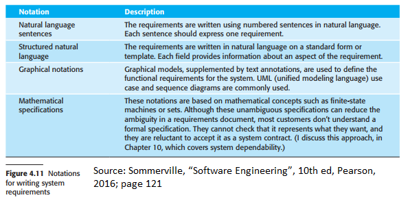

### Natural language specification

Natural language is used for writing requirements for software because it is 
easy to understand for anyone reading the document, regardless of how much of 
a technological background you have. However, this means that by using natural 
language, information may be vague and imprecise and it is up to the reader to 
understand the information. To minimize this, some guidelines when using natural language include:
* Keep the same writing format and use it for all requirements
* Use language consistently 
  * Use "shall" for meaning that the requirement is mandatory
  * Use "should" for meaning that the requirement is a goal that is not necessary 
  * Highlight text to identify what is important about that requirement
  * Avoid using computer jargon
  * Include an explanation about why the requirement is needed in the design 

Problems of natural language include:
* Impression and lack of clarity
* Functional and non-functional requirements can be mixed  
* Several requirements may be expressed together and be difficult to separate into individual requirements

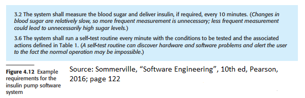

### Structured specifications

Structured specification involves writing system requirements in a standard way. 
As the name suggests, specifications are structured by usually using some sort of template. 

For example, an example template would be:
* Description of the component being specified (what are the functions)
* Description of inputs and their source
* Description of outputs and where their destination
* Description of how the component will do what it needs to do
* Description of any dependencies the component has
* Description of any precondition and postcondition if necessary
* Description of any side-effects 

This works best where requirements have a strict structure or have a 
complete understanding of the component. 

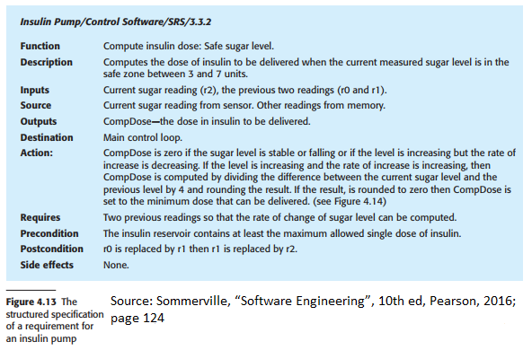

Tables are a useful way to visualize how components should react, especially 
if different actions can be taken depending on a condition.

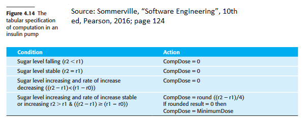

### Use cases 
Use cases describe the interaction between users and systems using the graphical 
model. This model shows who are the actors (the people that will interact with the system) 
and what actions they can take with the system. 

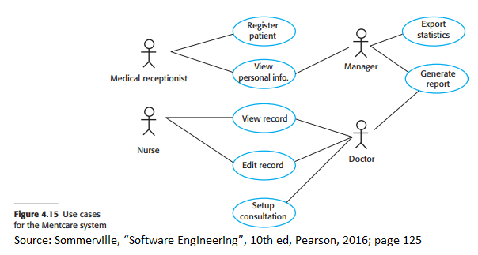

UML sequence diagrams can be made to add more depth to how interactions listed in the Use Case Diagram work. 

### Software Requirements Document 

The Software Requirement Document is a statement of what system developers 
need to do and combines user and system requirements into one document. 
It is not a document to show the design but rather it tells you WHAT the system should do 
instead of HOW to do it. 

agile methods argue that because requirements change frequently, this 
documentation will become out of date quickly. Agile methods argue that 
instead of creating such documentation, requirements should be addressed in increments of development. 

However, it is not as if the software requirements document is useless; 
it is especially vital when systems are outsourced to different teams; 
however and it is always good to have at least a short document that explicitly states what is required. 

Figure 4.16 shows the possible users of this document and how they may interact and use it. 

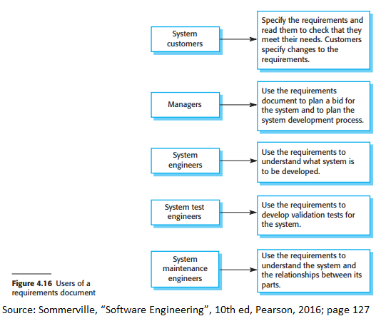

Information contained with this document depends on the type of system 
that is to be created as well as what development model is used. This document can 
also be influenced by any type of standard, such as the IEEE standard. 
Figure 4.17 shows a possible structure and outline of the document.

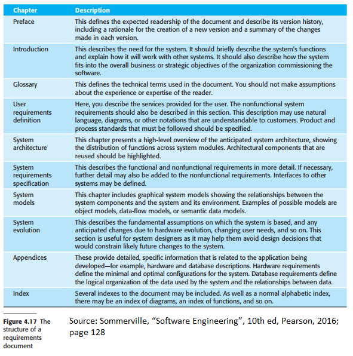

## 4.5 Requirements validation

Requirements validation involves checking the specified requirements to 
see if it is what stakeholders want. You can think of this as a process 
of double-checking the requirements. This step is important as errors in 
requirements are expensive so it is better to be able to fix the error before the system is delivered. 

Five potential problems of requirements that can be checked for in the requirements validation phase include:
* **Validity**
  *Do the functions added address what stakeholders require?
* **Consistency**
  *Do any requirements conflict with each other?
* **Completeness**
  * Are all the requirements from stakeholders addressed in the system?
* **Realism**
  * Can the answers to the requirements be implemented with the allocated budget and technology? 
* **Variability**
  * Can the requirements be checked (for example by using metrics?)?

There are three common ways requirements can be validated:
* **Requirements review**
  * A team of people analyzes and review the requirements
* **Prototyping**
  * A prototype is made and stakeholders can comment on whether this meets their expectations
* **Test-case generation** 
  * Requirements are tested; if the creation of the test is too difficult, it may mean that the requirement is too difficult to implement. 

## 4.6 Requirements change

Requirements are constantly changing, especially due to how the business 
environment changes due to changes to the economy and technological spheres. Examples of this include:
* Business and technical environment changes, such as new hardware being made and businesses may have new priorities. New legislation and regulations may also be made so that the system/product must abide by.
* People who pay for the system may not be users of the system.
  * For example, as the software development process advances, stakeholders may understand what they want better. This would mean that the end-users of a system may want new features that developers will need to add. 
* User communities are large and have different requirements that could conflict with each other 
  * Final systems must compromise between all the requirements users list. 

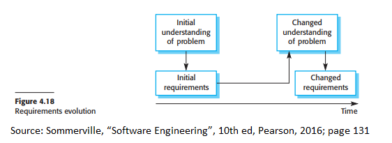

### Requirements management planning

Requirement Management is as the name sounds like; this is the process of 
managing changing requirements during the development process, especially 
when new requirements are needed. When new requirements are discovered and added, 
it is beneficial to track what connections (in other words how will it affect) any other requirements. 

Below are four considerations are taken in when management requirements:
* **Requirements identification**
  * requirements must be able to be uniquely identified
* **Change Management Process**
  * These activities will check how much impact and how costly a change will be if it is implemented
* **Traceability Policies**
  * These policies define relationships between each requirement as well as the system design
* **Tool support**
  * these are tools that can help record all the above data and aid in management. 

You will need tool support for the following:
* **requirements storage**
  * Requirement documentation will have to be accessible to everyone. 
* **change management**
  * tools can help track changes and how developers should respond to those changes
* **traceability management**
  * tools can help discovered relationships between requirements. 

### Requirements change management

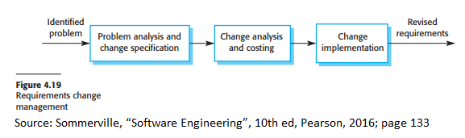

There are three mainstages to the change management process:
* **Problem analysis and change specification**
  * This is the preliminary step to check if the problem and solution/change is fully understood
* **Change analysis and costing**
  * This step involves assessing the effect of the proposed change and a decision regarding whether the change will be implemented. 
* **change implementation** 
  * The change is implemented and any required documentation is done. 

