# Chapter 5 System modeling
 
### Videos

System modeling videos [can be found
here](https://iansommerville.com/software-engineering-book/videos/req/)

## Preface
 
### What is system modeling
 
System modeling is the creation of abstract models to represent a system.
To create these models, the graphical modeling language is known as Unified
Modeling Langauge (UML) is generally used but there are other modeling
languages/techniques you can use. System modeling is important as each model
will show the perspective of a component(s) within the system and how it
interacts with other components, all of which is used to help people understand
how the system functions and how can it be used by stakeholders.
 
It is important to note that a system model is an ABSTRACTION of the system;
it will not tell you the lower-level details on how the system works but will
tell you the high-level functionalities so the model is easier to understand.
 
Example of models that you might create include (textbook pg. 139):
* An external perspective where you model the environment (such as other systems or software) that may interact with the system you are working on
* An interaction perspective where you show the interactions between the system and its environment and/or the interactions between components within the system
* A structural perspective where you show how data is pipelined and processed by the system and the hierarchy of components (and any other such organization) of the system
* A behavioral perspective where you show how the system will respond given certain inputs
 
### Graphical model usage
 
There are three main reasons why graphical models are used:
* Can help create discussion about the system and aid in deciding which components should be focused on
* Can be used as further documentation about the system
* Can help aid in implementing system features as they generalize what portions of code should be created
 
UML has 13 different types of diagrams; however, we will focus on only 5 of
them as these 5 are the most commonly used diagrams and generally represent
what parts are needed by the system. These diagrams are (textbook pg 141):
* **Activity diagrams**:  shows what steps are taken to process data
* **Use case diagrams**: shows interactions between the environment/context and the system
* **Sequence diagrams**: shows interactions between the actors/users and system components
* **Class diagrams**: shows relationships between object classes
* **State diagrams**: shows how the system will react to internal and external events
 
## 5.1 Context models
 
Context models are used to what boundaries does the system has. System
boundaries include systems that are used by or use the current system being
modeled. In other words, context models will show the environment that the
current system is used in.
 
Figure 5.1 shows an example context model.
 
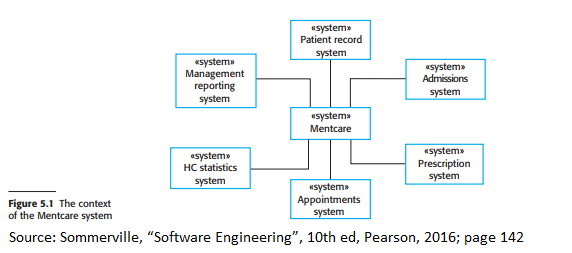
 
Notice how the context model only shows the environment that the system will be
used in. The context model does not tell developers how the system should be
developed and how it is used by the other systems. In other words, context models
just show that there are relationships between models but will not tell you what
happens in said relationship. External systems may input data into the current system;
these specific actions in their relationship will be outlined in other diagrams such as process diagrams.
 
 
### UML activity model
 
UML activity diagrams show the order in which actions are taken within a single
process and how the data is processed. Figure 5.2 is an example of a UML activity model.
 
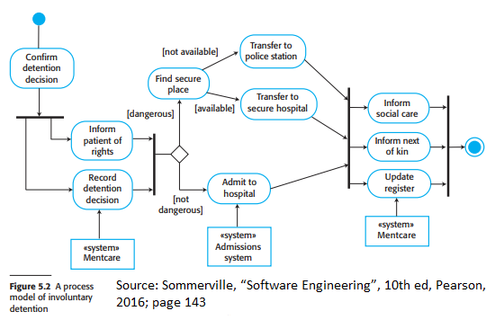
 
The starts of processes are indicated by a filled circle and the end of a process
is indicated by a filled circle surrounded by another circle. Rounded rectangles
represent activities that must be done. Arrows represent the direction/order in which
actions are taken place. A solid bar represents that activities happen at the same time;
every action that points to the same solid bar must happen before the next action after
the solid bar is taken. These arrows can also be annotated with notes surrounded by
square brackets to show the conditions in which those actions are taken.
 
As you can see in figure 5.2, you can add what systems are used in the process.
 
## 5.2 Interaction models
 
All systems involve interactions of some kind. This can be user interaction (which
involves user inputs and outputs), interaction between the software being developed and
other systems in its environment, or interaction between the components of a software
system. User interaction modeling is important as it helps to identify user requirements.
Modeling system-to-system interaction highlights the communication problems that
may arise. Modeling component interaction helps us understand if a proposed system
structure is likely to deliver the required system performance and dependability
Modeling these interactions is important as they identify potential problems and flaws that may occur, 
such as whether or not the system meets stakeholders' requirements.
 
In this section we will discuss two methods of interaction modeling:
* **Use case modeling**: shows user-system or system-system interactions (in other words interactions between the system and outside forces)
* **Sequence diagrams**: shows interactions between system components
 
 
### Use case modeling
 
Use case models were originally used during the requirements elicitation process 
but are also used for system modeling. Each use case shows an action between an 
actor (external agents) and the system.
 
Figure 5.3 shows an example use case diagram. The stick figures in the diagram  
represent external agents and do not necessarily mean it refers to people; 
for example, outside systems that affect the main system are external agents. 
The line between actors and the action represents the direction in which actions 
are taken. For example in figure 5.3, the medical receptionist does the action on 
transferring data to the patient record system because the line is pointed toward 
the patient record system. Any detail that is needed to completely described the 
interaction between two parties can be written in text form, tabulated, or written 
in a sequence diagram.
 
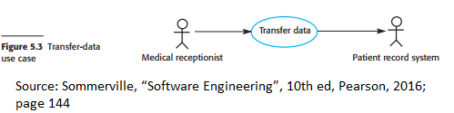
 
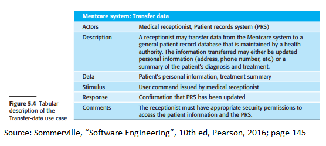
 
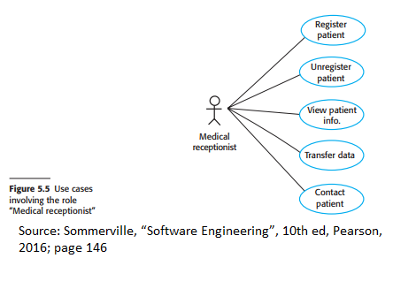
 
### Sequence diagrams
 
Sequence diagrams show the particular actions that occur in a use case. 
The sequence of interactions is read from top to bottom. Actors are shown 
on the top of the diagram as rectangles with vertical dotted lines under them. 
Annotated arrows represent the specific interactions between objects; 
these annotations should show what function call is used, its parameters, 
and its return values. Rectangles on the dotted line represent how long the 
object is used in the interaction.
 
Figures 5.6 and 5.7 are example sequence diagrams.
 
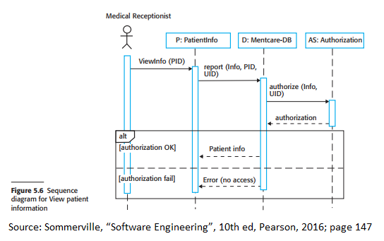
 
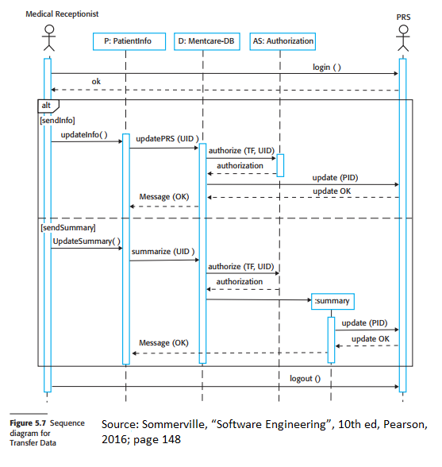
 
## 5.3 Structural models
 
Structural models show the components that make up the system. These models can be static,
meaning that it shows the structure of the system, or dynamic, meaning that it will show
how the system organization when a process is executing.
 
### Class diagrams
 
Class diagrams are used when developers are creating an object-oriented based system;
these digrams are necessary to show relationships between classes. The term "object class"
is used to represent one object/component within the system and the term "association"
represents a relationship or link between such object classes.
 
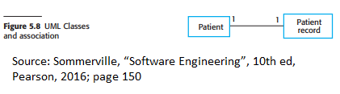
 
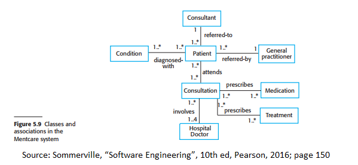
 
Figure 5.8 and 5.9 are examples of class diagrams. The numbers above the lines denote
the cardinality between both objects. For example, the relationship between Patient
and Consultant in Figure 5.9 is as follow:
* A patient is referred to one consultant
* A consultant has one or many patients.
 
Figure 5.10 uses UML to show the attributes and operations a class can do. In this class
diagram, the top rectangle contains the name of the object, the middle rectangle contains
class attributes and the bottom-most rectangle contains the operations/methods of the class.
 
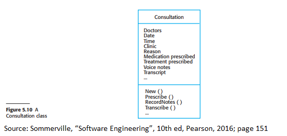
 
### Generalization
 
Generalization is used to show the complexity of a class. The top-most rectangle
is the most general class and every subsequent class below it narrows down the general
class into a more specific class based on characteristics to show how some classes have common characteristics.
 
Figure 5.11 shows an example of a generalization hierarchy. Arrows point upwards
the more general class. Lower-level classes inherit attributes and operations
found in higher-level classes that they point to (in other words their superclasses).
 
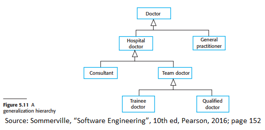
 
Figure 5.12 shows a generalization hierarchy but with added details.
 
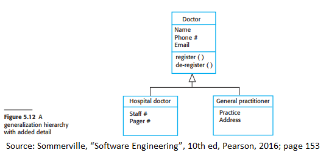
 
### Aggregation
 
Aggregation models show how classes may be composed of other classes.
 
Figure 5.13 is an example of an aggregation model.
 
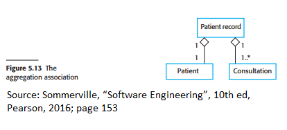
 
## 5.4 Behavioral models
 
Behavioral models show what should happen when the system receives an input. Inputs include:
 
* Data arrives that needs to be processed
* Events occur which might require the system to do some processing
 
### Data-driven modeling
 
Data-driven models show what steps are taken to process input data and their corresponding output.
 
Figure 5.14 is a simple activity diagram that shows the activities taken as
rounded rectangles and the data that is processed and/or outputted as rectangles.
 
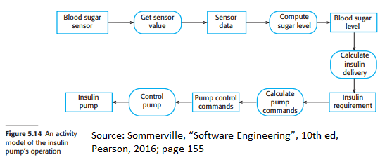
 
Figure 5.15 is an alternative using a sequence model. These models highlight
the objects in the system and what actions they can do. 
 
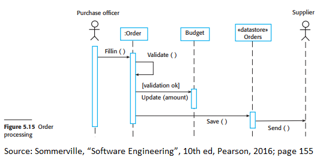
 
### Event-driven modeling
 
Event-driven models show how a system will react to any events, internal or
external. It is assumed that systems will have a finite number of states and
these events will cause the system to change states.
 
State Machine Models are an example of event-driven modeling; each node is a
state whereas the arcs/lines connecting such nodes represent events.
Figure 5.16 is an example of state machine models.
 
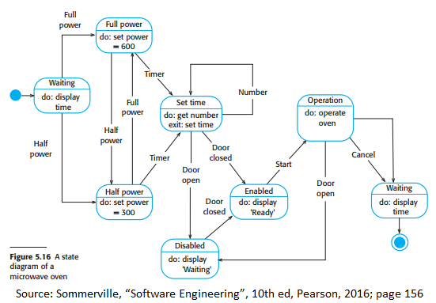
 
One flaw of state machine models is that there may be too many states to keep track of.
To encapsulate such data so it visually makes more sense, designers may group states
into a "superstate". Figure 5.17 shows an example of a superstate.
 
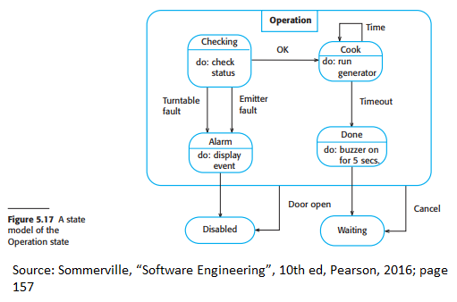
 
State models can also be supplemented with a table to describe each state and what
causes the changes between states; figure 5.18 shows an example of the table.
 
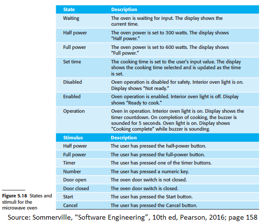
 
### Model-driven engineering
 
Model-Driven Engineering (MDE) is the approach where models are the results of the
development process instead of programs. Programs that are executed are created based
on those models; this would abstract the software engineering process in a way that
programming language details/specifics are not as important.
 
Pros of this approach include:
* Systems have a higher level of abstraction
* Code is automatically generated and has a low cost
 
Cons of this approach include:
* This does not model implementation so it may not work
* Costs of translating models to the correct platform may exceed saved costs of generating code
 
This approach is still being developed and the scopes of its effects on the
development process are not understood well enough yet. 
 
## 5.5 model-driven architecture
 
Model-Driven Architecture (MDA) is the precursor to MDE and focuses on creating UML
models to represent a system from different levels of abstraction. MDA recommends
showing three levels of abstraction through three such models:
* **Computation Independent Model (CIM)**
 * These model domain (for example security, patient records, etc.) abstractions
* **Platform Independent Model (PIM)**
 * These model how systems will operate and show how the system responds to events
* **Platform Specific Models (PSM)**
 * These show how PIMs are transformed for different application platforms. Figure 5.20 shows examples of such transformation. 
 
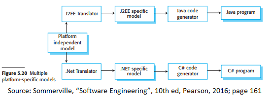
 
MDA has similar fundamentals to MDE where models can be created and eventually
implemented automatically by the software. Figure 5.19 shows this level of transformation.
 
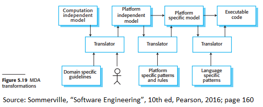
 
However like MDE, in practice, this level of transformation will most likely not
be possible as it is often too complex to implement due to how.
 
### Problems of MDA
 
The textbook outlines 4 other problems of MDA (textbook pg 161 - 162):
* Abstraction good for discussions does not necessarily mean that they are also good for implementation.
* Requirements engineering, security and dependability, integration with older/legacy systems, and testing are more important than implementation.
* Savings produced from MDA will be outweighed by the costs of creating/using tools needed for MDA for standard platforms (Windows, Linux, etc.)
* Agile methods are adopted more widely than when MDA methods were being developed and refined.
 
 
 
 
 

