# Chapter 7 Design and implementation

## Preface

Software design and implementation is the step where an actual executable
system is developed. The design and implementation steps are interleaved;  
the software design step involves identifying software components and relationships
between such components whereas the implementation phase is the phase where
the design is used to make the program.

One of the most important implementation decisions that are made during the
early stages of a software project is whether to build the application from
scratch or buy a similar application. If the latter is done, the design process
involves figuring out how to configure the application to adapt it to meet the
specific requirements of stakeholders.

## 7.1 Object-oriented design using the UML

An objected-oriented system uses interacting objects that keep track of their
local state and have operations they can do in that state. These states are
private and can not be accessed directly from anything other than the object.  
<<<<<<< HEAD
The objects also house data and methods to modify such data; changing the implementation
of an object should also not affect other objects (in other words, changes should only
affect itself).

To change an idea of a system design into an object-oriented design, you must (textbook pg. 198):

- Understand and define the context and any potential external interactions with the system
- Design the system architecture
- Identify principal objects in the system
- Develop design models
- Specify interfaces

### 7.1.1 System context and interactions

The first step should involve understanding relationships between software
components and the external environment. This is important as it will help
developers decide how to provide required system functionalities and how to
structure the system to be able to communicate with its environment. Understanding
such context also lets developers establish boundaries of the system which
can help them decided what features should be implemented in the system that
is to be made and what features are in any associated systems.

To show system context and interactions, two types of models are used:

- **System context model**: the structural model that shows connections with other systems in the environment.
- **Interaction model**: a dynamic model that shows how systems interacts with the environment

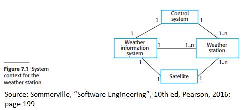

Figure 7.1 shows an example of a system context model. Lines between systems
show that there is a relationship between the systems. The numbers above the
line show the cardinality of the relationship. For example, on the line between
"Control System" and "Weather Station", it shows that **one** control system
can connect to **multiple** weather stations (or in other words, at least one
weather station is connected to the control system but there can be more than
one weather station connected to the control system)

Use case models are an example of an interaction model.
Figure 7.2 shows an example of a use case model.

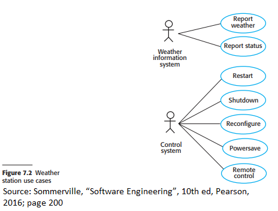

Figure 7.3 shows a description of a use case. These descriptions are used to
supplement use case diagrams to show any stimuli and/or outputs associated with the stimuli.

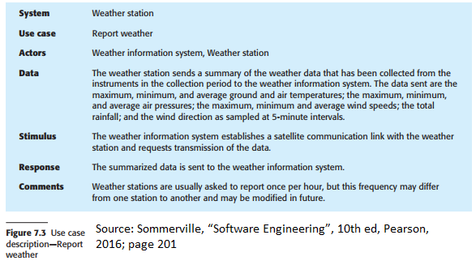

### 7.1.2 Architectural design

After understanding interactions between the software system and the system's
environment are designed, developers can use that information as the foundation
for designing the system architecture. First developers would identify any major
components that comprise the system and any interactions between such components.
Next developers would decide on how to organize the system; in other words what
architectural pattern (layered, client-server, etc.) would they use.

Figure 7.4 shows an example of architectural design where the weather station
is made up of different independent subsystems.

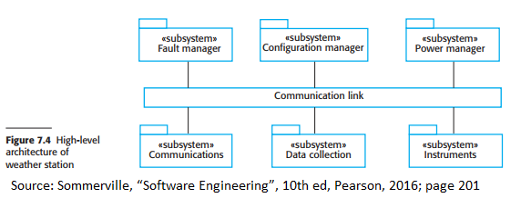

Figure 7.5 is an example of an architecture of a tat collection subsystem.

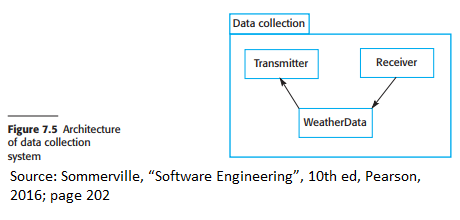

### 7.1.3 Object class identification

In this stage, developers will use their pre-existing knowledge found in previous
stages to more identify object classes. This knowledge can be gathered from informal
system descriptions, already known domain knowledge, retrieved from requirements
documentation, etc. Object identification is an iterative process as you are unlikely
to pinpoint all of the required objects correctly the first time.

Approaches to identifying object classes include (textbook pg. 202):

- Using a grammatical analysis of natural language descriptions
  - For example, attributes and objects are the nouns in the descriptions while operations or services are the verbs.
- Base the identification on tangible items in the application domain.
- Use a behavioral approach and identify objects based on what it does
- Use a scenario-based analysis where objects, attributes, and methods are identified in each scenario.

Figure 7.6 shows examples of five object classes.

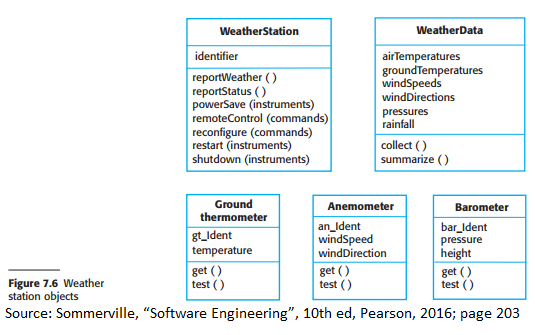

### 7.1.4 Design models

Design/system models show the object/object classes in a system as well as
relationships between them. These models are the basis for the implementation
of the system; they are abstract to hide any extra detail that is unnecessary
but has to have enough detail for implementation decisions to be made.

Two kinds of design models are used when UML is used to develop a design:

- **Structural models**: describe the static structure of the system in terms of the objects classes and the relationships between these object classes
- **Dynamic models** describe the dynamic interactions (in other words, interactions that happen during runtime) between objects

Three UML model types are used for adding more details to architectural models and use cases:

- **Subsystem models**: shows how objects can be grouped to form subsystems.
  - are represented using class diagrams
  - are structural models
- **Sequence models** show the sequence in which object interactions happen
  - are represented with collaboration diagrams or UML sequences
  - are dynamic models
- **State machine models** show how objects change states depending on the events
  - are presented using state diagrams
  - are dynamic models

### 7.1.5 Interface specification

It is important to create specifications of the interfaces between components
so that objects and subsystems can be designed in parallel. Interface design is
important as it tells the user what services and operations the system provides.
Interfaces should also hide the details of data representation used to store
information and only show the users any operations that can affect the
representation. The reason behind this is that if the data representation is hidden,
it can be changed without affecting anything that uses that data.

Figure 7.9 shows an example of two interfaces used for a weather station.

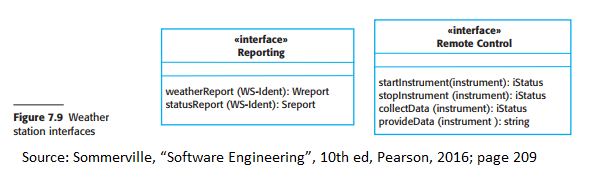

## 7.2 Design patterns

Design patterns are abstract descriptions of problems (or in other words a
culmination of knowledge) that can be reused for problems with similar requirements.
These descriptions usually have object-oriented characteristics such as polymorphism
and inheritance to be as general as possible and applicable to multiple similar problems.
These are used to instill the best practices or good designs.

Four essential elements of design patterns are (textbook pg. 210):

- A meaningful name that identifies the pattern
- A problem description
- A solution description that is a template for design solutions that can be done in different ways
- A statement telling the consequences (results and trade-offs)

One such pattern is the Observer pattern.

In the figure, the five essential components are as follow:

- **Name**: Observer Pattern
- **Description**: Separates the display of object states from the object itself (figure 11)
- **Problem Description**: Used when multiple displays of state are needed
- **Solution Description**: Figure 7.12
- **Consequences**: Optimizations to enhance display performance are impractical

Figure 7.10 explains this pattern description in more depth.

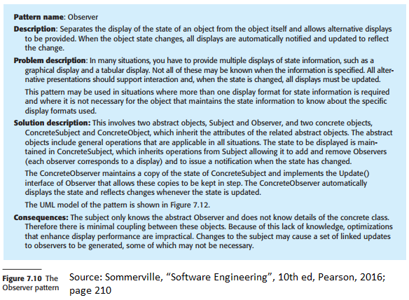

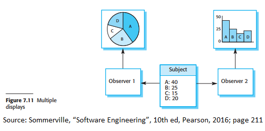

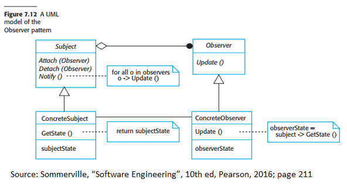

Examples of situations and what patterns to use in those situations are (textbook pg. 211):

- Tell objects the state of other objects have changes (Observer pattern)
- Clean up interfaces to several incrementally-developed related objects (Facade pattern)
- Provide a standard way to access elements in a collection (Iterator pattern)
- Allow for extending the functionality of a class during runtime (Decorator pattern)

## 7.3 Implementation issues

Some important aspects of software implementation are as follow:

- **Reuse**
  - developers should make use of any similar existing code
- **Confiugration management**
  - Version control should be kept on track
- **Host-target development**
  - Software is usually not executed on the device it is developed on; in other words, it is developed on a host system but executed on a different target system.

### 7.3.1 Reuse

Developing code from scratch is not as feasible today as in the past as costs
and schedule pressures are major concerns for commercial and Internet-based
systems. Because of this, development based on reusing existing software became
a prominent methodology for creating software.

Software reuse can be down at different levels:

- **Abstraction level**: software are not directly reused but knowledge and design abstractions are used
- **Object Level**: objects from libraries are reused
- **Component level**: components/collections of object and object classes are resued
- **System-level**: entire applications systems are reused

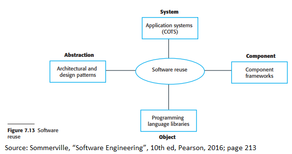

However, reusing software also has costs associated with it:

- Cost of time spent looking for software to reuse and analyzing whether it meets requirements
- Cost of buying reusable software
- Cost of adapting and configuring reusable software to meet the requirements
- Cost of integrating reusable elements with other reusable elements and self-coded elements

### 7.3.2 Configuration management

Configuration management is the process of managing change in a software system.
This is done so developers can access project doe and documentation in an orderly
fashion; developers can easily find out what changes have been made.
There are four fundamental configuration management activities:

- **Version management**: a process of keeping track of different versions of software components and coordinating development among multiple developers
- **System integration**: the process of helping developers pick which versions of components are used to create a new version of a system by linking and compiling such components
- **Problem tracking**: process in which users report bugs and developers can assign members to work on these problems
- **Release management**: process in which new versions of the software system has their functionalities planned and organized before release

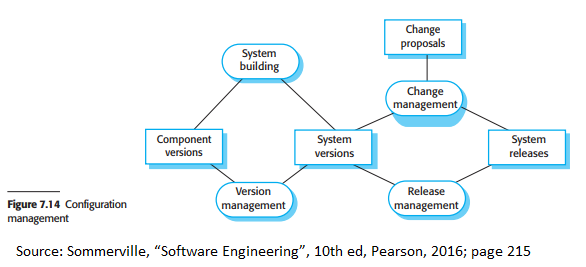

Examples of software management tools include Subversion and Git.

### 7.3.3 Host-target development

The most system is developed on a host computer(s) but run on an entirely
different target machine. In other words, we can separate the host and target
as a development platform and an execution platform respectively. Platforms
encompass hardware as well as operating systems, database management systems,
any interactive development environments, etc.

Software development platforms should provide the following (but are not limited to) tools:

- Integrated compiler and syntax-directed editing system that lets you create, modify, and compile code
- Language debugging system
- Graphical editings tools (for example to create UML models)
- Testing tools that automatically run a suite of tests on the latest version of the system
- Project support tools that can organize code

Software development tools are often grouped into an integrated development
environment (IDE). An IDE is a set of software tools that help aid developers in
different aspects of software development by bundling everything into a common
user interface or framework. IDEs usually support development in a specific
programming language or could be for general-purpose with specific language-support tools.

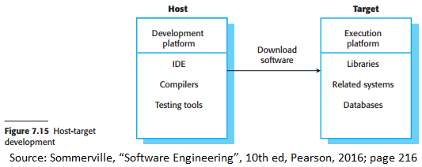

Issues that developers might run into when deciding how and which
platforms developed software will be deployed to include:

- **Hardware and software requirements of a component**
  - If a component is designed for or relies on specific hardware architecture, it must be deployed on a platform that has those requisites
- **Availability requirements of the system**
  - High availability systems may require components to be deployed on more than one platform in case of platform failure
- **Component communications**
  - If there is high traffic between components, components should be deployed on the same platform or platforms physically close to each other to reduce delay.

## 7.4 Open-source development

Open-source development is the process of publicly publishing source code
to a software system and allow volunteers to participate in its development
process. Due to the widespread usage of the Internet, it is easier to have a
large population of volunteer developers as they can be connected easier.
Examples of open-source products are Linux, Java, Apache web server, and
mySQL database management system.

Two open-source issues are as follow (textbook pg. 219):

- Should the product that is being developed make use of open-source components?
- Should an open-source approach be used for its software development?

Answers to the questions depend on the software being developed and the
experience of the developers. If the product is in a domain with high-quality
open source systems, you can save money and time using those components.
If the software has specific sets of organizational requirements, open-source
components may not be feasible. In other words, a decision ahs to be made
about whether integrating open-source components would be compatible with
the system and other requirements. If an open-source development process is done,
development costs will be mostly lowered, done quickly, and create a community
of users for the software easier.

### 7.4.1 Open-source licensing

Although open-source development means that source code is freely available,
this does not mean anyone can do anything they want with the code. Legally the
developer of the code owns the code and can place restrictions on how the
software can be used; these restrictions are outlined in an open-source software license.

Some models of open-source licenses include:

- **GNU Gneral Public Liscense (GPL)**
  - If you use the open-source software to make software, your software must make the software open-source
- **GNU Lesser General Public Liscnese (LGPL)**
  - A variant of GPL where you can create components that use the open-source code without publishing the code to create such components
- **Berkley Standard Distribution (BSD) License**
  - You are not obliged to republish modifications made to the open-source code and can include the code int systems that are to be sold.

Companies that use open source should consider (textbook pg. 221):

- Establish a system for maintaining information about open-source components that are downloaded and used
- Be aware of the different types of licenses for components and how these components can be used und ner those licenses
- Bew aware of evolution pathways for the components
  - You need to know about the open-source project and how it might change in the future
- Educate people,e about open source
  - Developers have to understand what is open source and what is open-source licensing.
- Have auditing systems in place
  - Someone has to check if developers may have broken the terms of a licenses
- Participate in the open-source community
  - You should participate and support the development of open-source products you use
