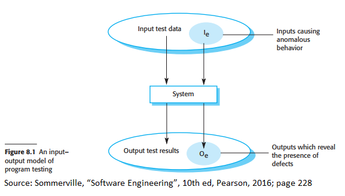
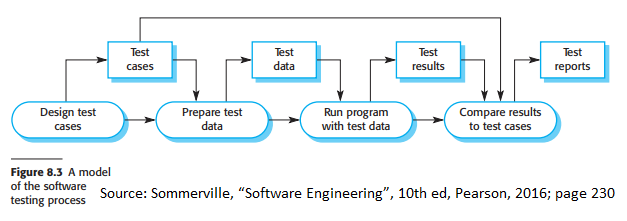
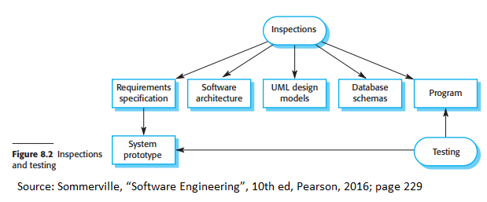
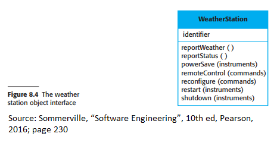
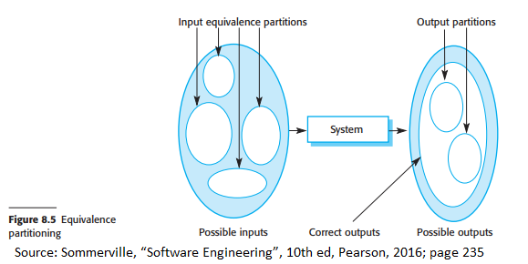
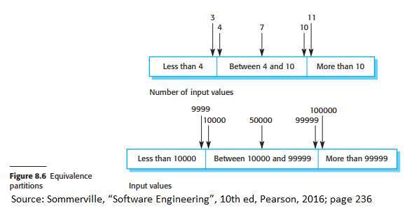
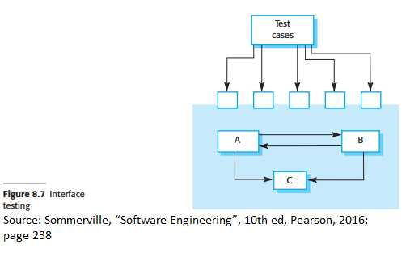
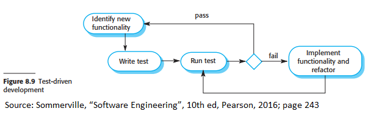
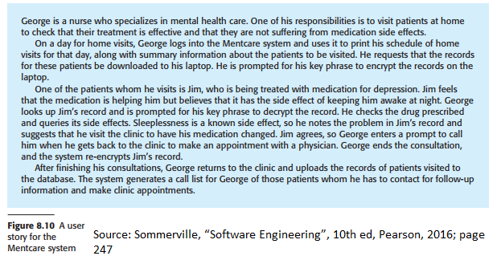
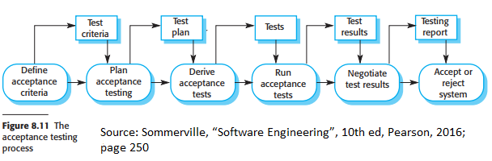

# Chapter 8 Software testing

## Preface

Testing is done to ensure that a program does what it is supposed to do before
it is deployed for consumer use. Testing is often done with dummy/artificial data
to check the test's results for errors or potential conflicts; however, do note
that testing only reveals that there is the presence of a specific error but not
the absence of an error.

When you are testing software, there are two main goals:

- Demonstrating that the software meets its requirements
  - This type of testing is known as validation testing.
- Discovering situations where the software does not behave as intended (results could be understandable, incorrect, or does not follow its specifications)
  - This type of testing is known as defect testing.

Validation testing aims to solve this first main goal. Validation testing
checks that given a set of test cases, the system performs its expected usage.
A successful test for this type of testing would show that the system works as intended.

Defect testing aims to solve the second main goal. As the name implies, defect
testing is the process of using test cases to expose defects. A successful test
of this type of testing would show that the system performs incorrectly and thus
a defect is exposed.

Figure 8.1 shows the difference between validation and defect testing. Defect
testing would test the inputs in the set Ie because those inputs show
problems in the system. Validation testing would test the correct inputs outside of Ie.

### Verification and validation

Testing is part of a process known as "verification and validation".
**Validation** asks the question "are we building the right product" (in other words,
is the software conforming to its specifications) whereas **verification**
asks the question "are we building the product right" (in other words does
the software do what the user requires?). The purpose of the verification
and validation process is to create confidence that the system is "fit for
its purpose", meaning it is good enough for its intended use. The level of
required confidence is determined by three factors:

- System purpose
  - The more critical the software, the more important it is that is reliable
- User expectations
  - Users expect software to be buggy or fail due to past experiences
  - At the beginning of a software's deployment, users may tolerate failure as the benefits of the system outweigh its failure
  - As the software becomes more popular, the software will need to be more reliable and be tested under thorough testing.
- Marketing environment
  - Software must take into consideration competing products.
  - Getting a product to market early may be more important than finding defects as users may be willing to trade-off reliability for a better price

Figure 8.3 is an example of the testing process. There are typically three stages of testing:

- **Development testing**: testing system during development to discover defects
- **Release testing**: testing a complete version of the system before it is sent for consumer use
- **User testing**: users test the system in their environment

The verification and validation process may involve software inspections
and reviews. This aspect involves analyzing and checking system requirements,
design models, source code, and system tests. This is known as the "static"
verification and validation techniques as you do not need to write or execute
any code and these techniques analyze the static system representation.
Software testing is known as dynamic verification as developers observe product
behavior by executing test data. Figure 8.2 shows an example of when software
inspections and testing can occur during a software's lifecycle.

Software inspection is mainly focused on looking through the source code but
can be applied to any representation of the system (ex. design models).
Software inspection has three advantages over testing:

- Errors can hide other errors during testing. Inspections is a static process so you do not have to be concerned about how errors may interact/affect each other
- Incomplete versions of systems can be inspected without additional costs as developers need to develop specialized tests to test the parts of the system that are completed.
- Inspection has boarder quality controls and can look for compliance with standards, portability, and maintainability.

Inspections and testing should be both used during the verification and
validation process as both are complementary to each other. For example,
inspections cannot check if non-functional requirements (such as performance
and usability) whereas testing can.

## 8.1 Development testing

Development testing, as the name suggests, encompasses all the testing the
the team does while developing the system. There are three main stages of development
testing:

- Unit testing: individual programs/objects are tested, focussing on testing functionality
- Component testing: testing composite components or groups of individual units, focusing on the interface that provides access to the component functions
- System testing: testing if most, if not all, components work when integrated as a whole

### 8.1.1 Unit testing

As stated previously, unit testing is the process of testing individual components
in isolation. It is usually a defect testing process where the units being
tested may be individual functions or methods of an object or object classes.

Object class testing is a form of unit testing where developers test operations
associated with an object, setting and changing object attributes, and using
the objects in all of their possible states.

Figure 8.4 is an example of a potential object to be unit tested. To unit test
the weather station object interface, you would need to test if it has been
properly instantiated. There should be test cases for all of the associated
methods (generally tested in isolation if methods do not rely on other methods).
State models can be used to identify how the object class transition from state
to state; testing should be done on the events that cause the transitions to happen.

Generalization or inheritance makes testing object classes more complicated as
you cannot assume operations for a class will work for all of its child classes.
Because of this, you would also have to individually test all child classes.

Unit testing can be automated by using test automation frameworks such as JUnit.
These frameworks can provide general test classes that can be extended to meet
developers' needs. After test classes are created, the frameworks can be used
to run the full suite of tests and report the success of the tests, oftentimes through some sort of GUI.

Automated test has three components:

- Setup: initialize the system with test cases (most likely sample inputs and expected outputs)
- Call: call the method/object and test it
- Assertion: compare the results of the call and the expected results

### 8.1.2 Choosing unit test cases

Testing is a time-consuming process so it is important to pick the most effective
unit test cases. Effectiveness in this context is defined as:

- The test cases show that the component does what it is supposed to do
- Defects in the components are shown by test cases

(textbook pg.234)

Because of this, developers should define two kinds of unit test cases:

- One kind of unit test case should reflect normal usage of the program and show that components work as intended
- One kind of unit test should test based on abnormal inputs to show that inputs are properly sanitized and processed and do to harmful components.

Two strategies used to choose test cases are:

- Partition testing: identify groups of common inputs that should be processed in the same way
- Guideline-based testing: use testing guidelines (usually shows typical kinds of errors) to choose test cases

Figure 8.5 outlines the idea of equivalent partitioning.
Input data and output often fall into different classes where programs behave
in the same way for each class member. Equivalence partitions/domains are this;
they are classes with similar behavior or characteristics.

On the left of Figure 8.5, the large shaded ellipse represents the set of all
possible inputs and the small unshaded eclipses represent equivalence partitions.
On the right of the figure, output equivalence partitions are partitions where the
outputs have something in common.

Note that equivalence partitions inputs and outputs are not guaranteed to be
mapped 1:1. Once you have picked a set of partitions, you would want to choose
test cases from each partition by choosing test cases on the boundaries of
such partitions as well as test cases in the midpoint of the partition. An example
of this is in figure 8.6 where if you are testing a sequence between 10000 and
99999, you want to test for 50000 and numbers on the left and right-hand sides.

Other methods to test sequences include:

- Test software with sequences with one value
- Use sequences of different sizes in different tests
- Test the first, middle, and last elements of the sequence
- Test with zero-length sequences

Examples of general testing guidelines include:

- Choose inputs that force the system to generate all error messages
- Design inputs that result in possible buffer overflows
- Repeat same input(s) multiple times
- Force invalid outputs to be generated
- Force computation results to be too large or too big

(textbook pg.237)

### 8.1.3 Component testing

Software components are generally several interacting objects bundled into a
composite component. The functionality of this composite component is accessed
through a component interface; thus testing composite components should focus on
showing that the component interface work based on its specifications.
Figure 8.7 shows the overall idea of component interface testing. Components A, B,
and C are integrated into one subsystem/larger component and assumed that unit tests
on those components work. Test cases for component testing are applied to this
interface of the composite component. The objective is then to detect faults due
to interface errors or invalid assumptions about the interface.

There are different types of interfaces between program components. of which include:

- Parameter interfaces: data is passed from one method/procedure to another
- Shared memory interfaces: block of memory is shared between procedures
- Procedural interfaces: a set of procedures is encapsulated and called by other subsystems
- Message passing interfaces: subsystems request services from other subsystems

Interface errors can be grouped into three main types:

- Interface misuse: a component called another component and made an error in using its interface (ex. parameters in the wrong order)
- Interface misunderstanding: a component embeds assumptions of the called component's behavior that is incorrect
- Timing error: both components are operating and different speeds and out-of-date information is accessed.

Examples of interface testing guidelines include:

- Designs tests so that parameters are at the extreme ends of their rages
- Pass null pointers as pointer parameters
- Designing tests that cause the component to fail
- Use stress testing in message-passing systems
- Vary order in which components are activated in shared memory systems

### 8.1.4 System testing

System testing involves integrating components into a system and running tests
on that version of the system. The focus of these tests is to test the interactions
between the components, making sure that the components are compatible with each
other and can successfully transfer the right data at the right time across their interfaces.

There is two main difference between component testing and system testing:

- In system testing, reusable components have been separately developed and have to be integrated with developed components before the entire system is tested.
- Components developed by different team members will be integrated at this stage.

Using use case models is helpful for system testing as they focus on interactions.
Each use case involves several system components so testing those user cases forces
interactions between components to occur.

Sequence diagrams are helpful to design test cases that you need as they show
what inputs are required and their respective outputs.

It is not possible to exhaustive test the system so testing policies are used to
test a subset of possible test cases. Example of testing policies include:

- All system functions accessed through menus should be tested
- Combinations of functions accessed through the same menu must be tested
- Function using user input must be tested with correct and incorrect inputs

## 8.2 Test-driven development

Test-driven development is the process fo interleaving testing and code
development. Tests are written before the code and tests fuel the development
procedures. Code and tets are developed incrementally and developers cannot move
to the next increment unless the code passes its tests.

Test-driven development is shown in figure 8.9 The steps in this process involve:

- Identify the increment for the functionality to be tested
- Write a test for the functionality, preferably implemented as an automated test
- Run the newly created test with previous tests (this test should fail as you have not implemented the functionality yet)
  - The purpose of doing this step is to check if the test functions and is not generating a false-positive
- Implement the functionality and re-run the test suite
- Move onto implementing the next increment of functionality

Benefits of test-driven development include:

- **Code coverage**: code segments are associated with at least one test
- **Regression testing**: the regression test suite is developed incrementally
- **Simplified debugging**: when a test fails, it means that the newly written code is faulty
- **System documentation**: tests can be a form of documentation that describes what code should do

Regression testing is the process of testing the system if changes are broken
previous working code. With an automated process, regression testing is simple as
all tests are rerun when a change is made.

## 8.3 Release testing

Release testing is the process of testing a release of the system that consumers will
be able to use. The goal of this is to convince developers that the system is ready
to be used. The system has to show that it can do its specified functionalities,
perform well, and does not fail during normal use.

Release testing is a form of system testing but there are two main differences:

- A sperate team not involved in system development should be responsible for the release testing
- System testing conducted by developers focuses on discovering bugs in the system whereas, in release testing, tests are done to check if the system meets its requirements and is usable.
  - In other words, system testing is a form of defect testing whereas releasing testing is a form of validation testing.

Release testing is usually a "black-box" testing process where tests are made
from the system specification and the tester does not care about how it is implemented.
This is also known as functional testing as the tester only cares about the
functionality of the code based on its inputs and outputs.

### 8.3.1 Requirements-based testing

Requirements-based testing is an approach where the tester considers each
requirement and creates a set of tests for the respective requirement.
This is more similar to validation testing as the tester is concerned with
showing that the system has implemented the desired requirement.

Let us take the Mentcare system requirements as an example. Some of the following
system requirements as follow:

- If a patient is known to be allergic to any particular medication, then a prescription of that medication shall result in a warning message being issued to the system user.
- If a prescriber chooses to ignore an allergy warning, they shall provide a reason why this has been ignored.

(textbook pg.246)

Some of the possible requirements tests to address the requirement
tests include:

- Set up a patient record with no known allergies. Prescribe medication for allergies that are known to exist. Check that a warning message is not issued by the system.
- Set up a patient record with a known allergy. Prescribe the medication that the patient is allergic to and check that the warning is issued by the system.
- Set up a patient record in which allergies to two or more drugs are recorded. Prescribe both of these drugs separately and check that the correct warning for each drug is issued.
- Prescribe two drugs that the patient is allergic to. Check that two warnings are correctly issued.
- Prescribe a drug that issues a warning and overrule that warning. Check that the system requires the user to provide information explaining why the warning was overruled.

(textbook pg.246)

Note that not solely one test is created to test a requirement; preferably
a whole suite of tests is run to ensure that you covered all parts of the requirements.

### 8.3.2 Scenario testing

Scenario testing is an approach of release testing where testers create scenarios
and use those scenarios to design tests for that scenario. Figure 8.10 is an
example of a user story/scenario for the Mentcare system.

Features that could be tested from this scenario include:

- Authentication by logging on to the system
- Downloading and uploading patient records
- Home visit scheduling
- Encryption and decryption of patient records on a mobile device
- Record retrieval and modification
- Links to drug databases that contain side-effect information
- System for call prompting

### 8.3.3 Performance testing

Performance tests are designed to test if the system can process its intended
load. Often this would mean a suite of tests is run where the workload is
increased until the system cannot perform to acceptable standards.

Stress testing is a form of performance testing where the system is deliberately
overloaded to see how the system will behave and is especially used in distributed
systems. Stress testing has two main benefits:

- Tests show the system behaves during failure when the load is exceeded
  - System should not cause data corruption or loss os user services
  - Want to "fail-soft" in this scenario
- Show defects that happen when the system is fully loaded

## 8.4 User testing

User/customer testing, as the name suggests, is the stage where users and customers
can provide their input and advice on the system. This is important as the user's
working environment cannot be replicated in a testing environment and although the
system works on the developer's machines, it might not perform adequately on the consumers' machine.

There are three types of user testing:

- **Alpha testing**: users of the software work with the development team to test the software at the developer's site
- **Beta testing**: software release is made available to everyone to experiment with
- **Acceptance testing**: customers test a system and decide whether it can be deployed in the customer environment

Alpha testing involves users and developers working together to test a system.
The user will identify problems and issues that developer testing teams did not
notice and can provide information about their practice that helps developers create better tests.

Beta testing involves early releases or unfinished systems. Beta testers could
be a selected group of customers or made public to everyone. It is used to discover
interaction problems between software and features in the environment the system is run on.

Figure 8.11 shows the six main stages of the acceptance testing process:

- **Define acceptance criteria**
  - Occurs early in the software lifecycle
  - Acceptance criteria should be part of the system contract and approved by developers and customers
  - In practice difficult to do because detailed requirements may not be available so early in the process and requirements will almost always change
- **Plan acceptance testing**
  - Involves deciding on resources, budget, and time for acceptance testing and schedule.
- **Derive acceptance tests**
  - Tests are designed to test functional and non-functional characteristic
- **Run acceptance tests**
  - Acceptance tests are executed
- **Negotiate test results**
  - Not all acceptance tests will pass; developers and customers will have to decide if the system is good enough to be used despite some problems
- **Reject/accept system**
  - Determine if the system is good enough to move to the next acceptance testing phase

In agile methods, the user/customer is part of the development team and is
responsible for making decisions on the acceptability of the system. The
user/customer defines the tests and there is no separate acceptance testing
process. One problem with this is that the embedded user (in other words the
user that works with the team) may not represent the interests of all the stakeholders.
